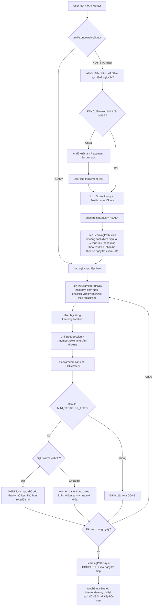
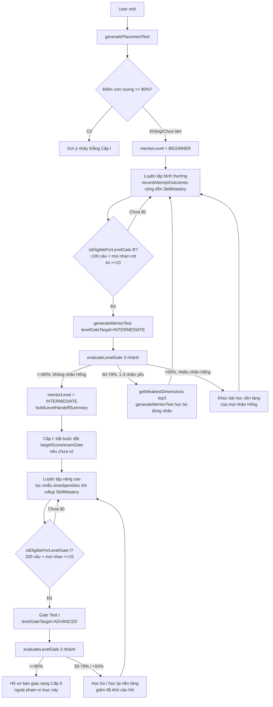

# AI Mentor — Kiến trúc hệ thống (Giai đoạn 1)

> Trạng thái: **Đề xuất, chờ duyệt.** Chưa migrate DB, chưa viết code backend/frontend.
> Phạm vi tài liệu: Database schema, luồng dữ liệu, tech stack streaming.

## 0. Nguyên tắc thiết kế

TOEIC Mastery đã có sẵn rất nhiều nền tảng mà AI Mentor cần — nguyên tắc xuyên
suốt tài liệu này là **tái dùng những gì đã đúng, chỉ thêm bảng mới cho phần
thật sự chưa tồn tại**:

| Đã có sẵn (tái dùng) | Vai trò trong AI Mentor |
|---|---|
| `Profile.currentScore/targetScore/examDate/streakCount` | Input cho onboarding + lộ trình |
| `Attempt` / `AttemptAnswer` / `ScoreHistory` | Nguồn telemetry thô (điểm, đúng/sai, thời gian) |
| `StudySession` (activityType, metadata Json) | Log hoạt động học theo phiên |
| `UserVocabulary` + `VocabularyReview` (SM-2 đã code sẵn trong `spaced-repetition.ts`) | Chính là "Vocab Ledger" — không viết lại |
| `Question.vocabularyFocus[]` / `grammarTopicSlug` / `evidenceText` | Cầu nối để tự động đưa từ sai vào ôn tập + để RAG trích dẫn |
| `recommendation.ts` (rule-based, đang chạy) | Sẽ được **nâng cấp thành input cho AI**, không xóa — AI dùng làm baseline khi chưa đủ dữ liệu |
| `/api/vocabulary/export-pdf` (đã có `@react-pdf/renderer`) | Tái dùng cho tính năng xuất từ vựng yếu, chỉ thêm filter |
| `rate-limit.ts` (in-memory, single instance) | Tái dùng để giới hạn số tin nhắn AI/ngày theo `PlanTier` |
| `/api/cron/*` (đã có cron pattern) | Tái dùng cho job đồng bộ embedding, không cần thêm queue/Redis ở MVP |

Phần **thực sự mới**: hội thoại + trí nhớ dài hạn, bảng rollup điểm mạnh/yếu
(cache tính từ dữ liệu thô ở trên), lộ trình học cá nhân hóa theo ngày, đề
kiểm tra tự chọn từ ngân hàng câu hỏi có sẵn, và vector store cho RAG.

**Quyết định kiến trúc quan trọng nhất:** AI Mentor **không tự sinh câu hỏi
TOEIC mới**. Nó chỉ *lọc/chọn* từ ngân hàng `Question` đã được admin duyệt
(theo `part`, `difficulty`, `grammarTopicSlug`, `vocabularyFocus`). Lý do: một
LLM tự bịa câu hỏi TOEIC có rủi ro sai đáp án/giải thích — với sản phẩm luyện
thi, độ chính xác quan trọng hơn tính "sáng tạo". LLM chỉ tạo ra *văn bản giải
thích* và *quyết định nên chọn câu nào*, không tạo *nội dung câu hỏi*.

---

## 1. Database Schema

### 1.1 Thay đổi cộng thêm vào bảng đã có

```prisma
// Thêm vào model Profile — biết trạng thái onboarding mà không cần query
// nhiều bảng khác mỗi lần mở chat.
enum OnboardingStatus {
  NOT_STARTED       // Chưa có targetScore/examDate, chưa có attempt hoàn chỉnh nào
  PLACEMENT_PENDING // Đã khai mục tiêu qua chat, chưa làm placement test
  READY             // Đã có điểm nền (placement hoặc attempt thật) + mục tiêu
}

// model Profile { ... +
  onboardingStatus      OnboardingStatus @default(NOT_STARTED) @map("onboarding_status")
  onboardingCompletedAt DateTime?        @map("onboarding_completed_at")
// }

// Thêm vào model UserVocabulary — phân biệt từ user tự lưu và từ AI phát
// hiện user sai trong Reading/Listening (Module 4).
enum VocabOrigin {
  MANUAL
  AI_DETECTED_WEAKNESS
}

// model UserVocabulary { ... +
  origin               VocabOrigin @default(MANUAL)
  sourceAttemptAnswerId String?    @map("source_attempt_answer_id") @db.Uuid
// }
```

### 1.2 Bảng mới — Chat & Trí nhớ dài hạn (Module 5)

```prisma
enum MentorRole {
  USER
  ASSISTANT
  SYSTEM
}

enum MentorConversationStatus {
  ACTIVE
  ARCHIVED
}

model MentorConversation {
  id     String                   @id @default(uuid()) @db.Uuid
  userId String                   @map("user_id") @db.Uuid
  title  String?                  // sinh tự động từ tin nhắn đầu, cho sửa
  status MentorConversationStatus @default(ACTIVE)

  /** Câu hỏi/bài attempt mà hội thoại được mở ra từ đó (nút "Hỏi AI" trên
   * màn hình luyện tập) — để lượt chat đầu tiên có sẵn ngữ cảnh (options,
   * evidenceText, đáp án user chọn) mà không cần hỏi lại user. */
  originQuestionId String? @map("origin_question_id") @db.Uuid
  originAttemptId  String? @map("origin_attempt_id") @db.Uuid

  lastMessageAt DateTime @default(now()) @map("last_message_at")
  createdAt     DateTime @default(now()) @map("created_at")
  updatedAt     DateTime @updatedAt @map("updated_at")

  user           Profile         @relation(fields: [userId], references: [id], onDelete: Cascade)
  originQuestion Question?       @relation(fields: [originQuestionId], references: [id], onDelete: SetNull)
  originAttempt  Attempt?        @relation(fields: [originAttemptId], references: [id], onDelete: SetNull)
  messages       MentorMessage[]
  generatedTests MentorTest[]

  @@index([userId, lastMessageAt])
  @@map("mentor_conversations")
}

model MentorMessage {
  id             String     @id @default(uuid()) @db.Uuid
  conversationId String     @map("conversation_id") @db.Uuid
  role           MentorRole
  content        String

  /** Payload có cấu trúc render kèm bubble (thẻ đề xuất, link MentorTest,
   * chip từ vựng yếu) — tách khỏi `content` để stream SSE chỉ chở text
   * thuần, không phải parse JSON giữa chừng token. */
  attachments Json?

  tokenCount Int?    @map("token_count") // null cho tới khi stream xong — theo dõi chi phí
  modelId    String? @map("model_id")
  createdAt  DateTime @default(now()) @map("created_at")

  conversation MentorConversation @relation(fields: [conversationId], references: [id], onDelete: Cascade)

  @@index([conversationId, createdAt])
  @@map("mentor_messages")
}

/**
 * Trí nhớ dài hạn theo user (Module 5) — bản tóm tắt được cập nhật định kỳ
 * ("hôm qua user vướng câu hỏi đuôi ở Part 6, đã hẹn ôn lại hôm nay"), tách
 * khỏi MentorMessage thô để prompt context luôn nhỏ & cố định thay vì phát
 * lại toàn bộ lịch sử chat mỗi lượt. Một background job tóm tắt lại khi số
 * tin nhắn chưa gộp vượt ngưỡng.
 */
model MentorMemory {
  id                String    @id @default(uuid()) @db.Uuid
  userId            String    @unique @map("user_id") @db.Uuid
  summary           String
  summarizedThrough DateTime? @map("summarized_through") // mốc MentorMessage.createdAt đã gộp tới
  updatedAt         DateTime  @updatedAt @map("updated_at")

  user Profile @relation(fields: [userId], references: [id], onDelete: Cascade)

  @@map("mentor_memories")
}
```

### 1.3 Bảng mới — Rollup điểm mạnh/yếu (Module 2/3)

```prisma
enum SkillDimensionType {
  PART          // dimensionKey = giá trị TestPart, vd "PART5"
  GRAMMAR_TOPIC // dimensionKey = GrammarTopic.slug
  VOCAB_TOPIC   // dimensionKey = VocabularyTopic.slug
}

/**
 * Cache được tính lại từ Attempt/AttemptAnswer/StudySession sau mỗi lần nộp
 * bài — KHÔNG phải nguồn sự thật thứ hai cho dữ liệu thô. Giúp mentor trả
 * lời "chỗ nào đang yếu" bằng một lookup có index, thay vì quét
 * attempt_answers mỗi lượt chat.
 */
model SkillMastery {
  id              String             @id @default(uuid()) @db.Uuid
  userId          String             @map("user_id") @db.Uuid
  dimensionType   SkillDimensionType @map("dimension_type")
  dimensionKey    String             @map("dimension_key")
  attemptedCount  Int                @default(0) @map("attempted_count")
  correctCount    Int                @default(0) @map("correct_count")
  masteryScore    Float              @default(0) @map("mastery_score") // EWMA 0-1, ưu tiên lần gần đây
  lastPracticedAt DateTime?          @map("last_practiced_at")
  updatedAt       DateTime           @updatedAt @map("updated_at")

  user Profile @relation(fields: [userId], references: [id], onDelete: Cascade)

  @@unique([userId, dimensionType, dimensionKey])
  @@index([userId, masteryScore])
  @@map("skill_mastery")
}

/** Cơ chế mở khóa độ khó (Module 3: "vượt qua test mới mở phần khó hơn").
 * Một dòng mỗi khi user chinh phục xong một mức độ khó của một dimension. */
model SkillUnlock {
  id            String             @id @default(uuid()) @db.Uuid
  userId        String             @map("user_id") @db.Uuid
  dimensionType SkillDimensionType @map("dimension_type")
  dimensionKey  String             @map("dimension_key")
  difficulty    Difficulty         @default(EASY)
  unlockedAt    DateTime           @default(now()) @map("unlocked_at")

  user Profile @relation(fields: [userId], references: [id], onDelete: Cascade)

  @@unique([userId, dimensionType, dimensionKey, difficulty])
  @@map("skill_unlocks")
}
```

### 1.4 Bảng mới — Lộ trình học cá nhân hóa theo ngày (Module 1)

> Khác với `VocabularyPath` hiện có (lộ trình từ vựng 20 ngày *cố định, dùng
> chung cho mọi user*), `LearningPath` ở đây là **theo từng user, xuyên suốt
> mọi loại nội dung** (ngữ pháp, từ vựng, nghe, đọc, mini-test) và do AI sinh
> ra dựa trên mục tiêu + điểm yếu thật của người đó.

```prisma
enum LearningPathStatus {
  ACTIVE
  COMPLETED
  ABANDONED
}

enum LearningDayStatus {
  LOCKED
  UNLOCKED
  IN_PROGRESS
  COMPLETED
}

enum LearningItemType {
  GRAMMAR_LESSON
  VOCAB_TOPIC
  VOCAB_REVIEW       // đợt ôn SRS đến hạn — không có refId cố định
  LISTENING_PRACTICE
  READING_PRACTICE
  MINI_TEST
  FULL_TEST
  TIP
}

enum LearningItemStatus {
  PENDING
  DONE
  SKIPPED
}

model LearningPath {
  id          String             @id @default(uuid()) @db.Uuid
  userId      String             @unique @map("user_id") @db.Uuid
  status      LearningPathStatus @default(ACTIVE)
  targetScore Int                @map("target_score")
  examDate    DateTime?          @map("exam_date") @db.Date
  rationale   String?            // vì sao AI chia lộ trình thế này — hiện trong tooltip UI
  createdAt   DateTime           @default(now()) @map("created_at")
  updatedAt   DateTime           @updatedAt @map("updated_at")

  user Profile           @relation(fields: [userId], references: [id], onDelete: Cascade)
  days LearningPathDay[]

  @@map("learning_paths")
}

model LearningPathDay {
  id            String            @id @default(uuid()) @db.Uuid
  pathId        String            @map("path_id") @db.Uuid
  dayNumber     Int               @map("day_number")
  scheduledDate DateTime          @map("scheduled_date") @db.Date
  focusParts    TestPart[]        @map("focus_parts")
  status        LearningDayStatus @default(LOCKED)
  summary       String?
  completedAt   DateTime?         @map("completed_at")
  createdAt     DateTime          @default(now()) @map("created_at")

  path  LearningPath        @relation(fields: [pathId], references: [id], onDelete: Cascade)
  items LearningPathItem[]

  @@unique([pathId, dayNumber])
  @@index([pathId, scheduledDate])
  @@map("learning_path_days")
}

/** refId đa hình theo itemType — cùng pattern với Bookmark hiện có, thay vì
 * một bảng junction riêng cho từng loại nội dung. */
model LearningPathItem {
  id         String             @id @default(uuid()) @db.Uuid
  dayId      String             @map("day_id") @db.Uuid
  itemType   LearningItemType   @map("item_type")
  refId      String?            @map("ref_id") @db.Uuid
  orderIndex Int                @default(0) @map("order_index")
  status     LearningItemStatus @default(PENDING)
  createdAt  DateTime           @default(now()) @map("created_at")

  day LearningPathDay @relation(fields: [dayId], references: [id], onDelete: Cascade)

  @@index([dayId, orderIndex])
  @@map("learning_path_items")
}
```

### 1.5 Bảng mới — Đề kiểm tra tự chọn (Module 3)

```prisma
enum MentorTestStatus {
  PENDING
  IN_PROGRESS
  PASSED
  FAILED
}

model MentorTest {
  id             String             @id @default(uuid()) @db.Uuid
  userId         String             @map("user_id") @db.Uuid
  conversationId String?            @map("conversation_id") @db.Uuid
  dimensionType  SkillDimensionType @map("dimension_type")
  dimensionKey   String             @map("dimension_key")
  status         MentorTestStatus   @default(PENDING)
  passThreshold  Float              @default(0.8) @map("pass_threshold")
  score          Float?
  startedAt      DateTime?          @map("started_at")
  completedAt    DateTime?          @map("completed_at")
  createdAt      DateTime           @default(now()) @map("created_at")

  user         Profile             @relation(fields: [userId], references: [id], onDelete: Cascade)
  conversation MentorConversation? @relation(fields: [conversationId], references: [id], onDelete: SetNull)
  questions    MentorTestQuestion[]

  @@index([userId, status])
  @@map("mentor_tests")
}

model MentorTestQuestion {
  id            String    @id @default(uuid()) @db.Uuid
  mentorTestId  String    @map("mentor_test_id") @db.Uuid
  questionId    String    @map("question_id") @db.Uuid
  orderIndex    Int       @default(0) @map("order_index")
  selectedLabel String?   @map("selected_label") @db.VarChar(1)
  isCorrect     Boolean?  @map("is_correct")
  answeredAt    DateTime? @map("answered_at")

  mentorTest MentorTest @relation(fields: [mentorTestId], references: [id], onDelete: Cascade)
  question   Question   @relation(fields: [questionId], references: [id], onDelete: Cascade)

  @@unique([mentorTestId, questionId])
  @@map("mentor_test_questions")
}
```

> Cân nhắc đã loại bỏ: gắn thẳng vào `Attempt`/`AttemptAnswer` hiện có (thêm
> `mentorTestId` nullable). Chọn tách riêng `MentorTest*` vì `Attempt` đang
> gắn chặt với logic tính XP/streak/full-test hiện tại — thêm nhánh rẽ vào đó
> rủi ro phá vỡ hành vi đang chạy tốt, trong khi bảng riêng thì an toàn cộng
> thêm (additive) và vẫn tái dùng được `Question`.

### 1.6 Bảng mới — Vector store cho RAG (Module 2)

```prisma
enum EmbeddingSourceType {
  GRAMMAR_LESSON
  VOCABULARY_WORD
  QUESTION_EXPLANATION
  VOCABULARY_TOPIC
}

/**
 * pgvector ngay trên Postgres tự host hiện tại — không thêm Pinecone/dịch vụ
 * ngoài, đúng tinh thần "self-hosted, không pooler, không dịch vụ thừa" đã
 * ghi trong .env.example. Số chiều (1024) là tạm — chốt theo nhà cung cấp
 * embedding chọn ở mục 3.
 */
model ContentEmbedding {
  id              String              @id @default(uuid()) @db.Uuid
  sourceType      EmbeddingSourceType @map("source_type")
  sourceId        String              @map("source_id") @db.Uuid // Question/GrammarLesson/VocabularyWord/VocabularyTopic.id
  chunkIndex      Int                 @default(0) @map("chunk_index")
  content         String              // đúng đoạn text đã đem đi embed
  embedding       Unsupported("vector(1024)")
  embeddingModel  String              @map("embedding_model")
  sourceUpdatedAt DateTime            @map("source_updated_at") // updatedAt của nguồn tại thời điểm embed, để biết khi nào cần re-embed
  createdAt       DateTime            @default(now()) @map("created_at")

  @@unique([sourceType, sourceId, chunkIndex])
  @@map("content_embeddings")
}
```

**Lưu ý kỹ thuật (áp dụng ở Giai đoạn 2):** Prisma không tạo được extension
`vector` hay index `ivfflat`/`hnsw` chỉ bằng `schema.prisma` — cần chạy
`prisma migrate dev --create-only` rồi tay thêm `CREATE EXTENSION IF NOT
EXISTS vector;` + `CREATE INDEX ... USING hnsw (embedding vector_cosine_ops)`
vào file migration sinh ra. Truy vấn similarity cũng phải qua `db.$queryRaw`
(toán tử `<=>`) vì Prisma Client không sinh được vector query tự nhiên. Đây
là hạn chế đã biết, không phải rủi ro — cùng cách các dự án Prisma + pgvector
khác vẫn làm.

---

## 2. System Flow — "Tôi không hiểu câu hỏi này" → giải thích + mini-test

```mermaid
sequenceDiagram
    participant U as User (Browser)
    participant FE as Next.js Client (Zustand + TanStack Query)
    participant API as Route Handler /api/mentor/messages (SSE)
    participant CTX as Context Builder (mentor-context.ts)
    participant PG as Postgres (Prisma + pgvector)
    participant LLM as Claude (streaming)
    participant BG as Background (fire-and-forget)

    U->>FE: Gõ "Tôi không hiểu câu này" (kèm questionId, attemptId)
    FE->>FE: Optimistic UI: chèn bubble user ngay + bubble "..." cho assistant
    FE->>API: POST /api/mentor/messages (SSE) {conversationId, text, questionId}
    API->>PG: INSERT MentorMessage(role=USER)
    API->>CTX: buildContext(userId, conversationId, questionId)
    CTX->>PG: SELECT Question+Options+AttemptAnswer, SkillMastery, LearningPathDay hôm nay, MentorMemory.summary, 10 message gần nhất
    CTX->>PG: Embed nội dung câu hỏi → similarity search ContentEmbedding (pgvector `<=>`) lấy top-K ngữ pháp/từ vựng liên quan
    PG-->>CTX: Context bundle (điểm yếu, đoạn RAG, lộ trình hiện tại)
    CTX-->>API: Prompt lắp ráp (system + context + lịch sử ngắn)
    API->>LLM: stream(messages, tools=[recommend_mini_test])
    loop mỗi token
        LLM-->>API: token
        API-->>FE: SSE event: data: {delta}
        FE-->>U: Render token vào đúng bubble assistant (các bubble cũ không re-render)
    end
    LLM-->>API: stream kết thúc + tool_call recommend_mini_test(dimension)
    API->>PG: INSERT MentorMessage(role=ASSISTANT, content, attachments)
    API->>PG: SELECT Question WHERE part/dimensionKey khớp, difficulty phù hợp, status=PUBLISHED, LIMIT n
    API->>PG: INSERT MentorTest + MentorTestQuestion[]
    API-->>FE: SSE event: done {attachments: {mentorTestId}}
    FE-->>U: Hiện thẻ "Làm 5 câu kiểm tra nhanh"
    API->>BG: enqueue (không await, không chặn response)
    BG->>PG: Cập nhật SkillMastery; đưa từ vựng sai vào UserVocabulary (origin=AI_DETECTED_WEAKNESS)
    BG->>PG: Nếu số message chưa gộp > ngưỡng → cập nhật MentorMemory.summary

    U->>FE: Làm xong MentorTest, nộp bài
    FE->>API: POST /api/mentor/tests/:id/submit {answers}
    API->>PG: Chấm điểm, UPDATE MentorTest.status/score
    alt Đạt >= passThreshold
        API->>PG: UPSERT SkillUnlock (mở khóa difficulty tiếp theo)
        API->>PG: UPDATE LearningPathItem/Day liên quan → COMPLETED, mở ngày kế tiếp
    else Chưa đạt
        API->>PG: Giữ nguyên khóa; đánh dấu để lộ trình chèn thêm bài ôn trước khi cho làm lại
    end
    API-->>FE: Kết quả + gợi ý bước tiếp theo
```

### 2.1 Luồng Cold Start & vòng lặp học thích ứng theo ngày (Module 1)



---

## 3. Tech Stack & kiến trúc streaming Frontend ↔ Backend

### 3.1 Vì sao SSE, không phải WebSocket

Hệ thống chạy trên **VPS tự host, process Node thường trực sau Nginx** (không
phải serverless — xem `UPLOADS_DIR` phục vụ qua Nginx, `PrismaPg` adapter
dùng kết nối trực tiếp không pooler). Điều này gỡ bỏ nỗi lo lớn nhất khi dùng
SSE trên Vercel (timeout hàm 10-60s) — response có thể mở stream dài mà không
bị cắt.

AI Mentor không cần push 2 chiều ngoài phạm vi một lượt hỏi-đáp, nên WebSocket
là over-engineering: cần thêm hạ tầng ws server, sticky session khi scale
ngang, quản lý reconnect — trong khi SSE qua Route Handler trả về
`ReadableStream` vừa tái dùng được cookie session hiện có, vừa không cần hạ
tầng mới.

```
Client (fetch, POST + body JSON)
   │  Accept: text/event-stream, credentials: include (cookie session sẵn có)
   ▼
Route Handler  src/app/api/mentor/messages/route.ts
   │  return new Response(readableStream, { headers: { "Content-Type": "text/event-stream" } })
   ▼
Client đọc bằng ReadableStreamDefaultReader (không dùng EventSource — nó chỉ
hỗ trợ GET, không gửi được POST body/cookie tùy biến), decode từng chunk,
cập nhật bubble assistant đang stream.
```

### 3.2 Thư viện đề xuất — cần anh/chị duyệt trước khi thêm dependency

Đề xuất dùng **Vercel AI SDK** (`ai` + `@ai-sdk/anthropic`) thay vì tự viết
tay toàn bộ phần stream reducer + reconnect + tool-calling:

- `streamText()` phía server: chuẩn hóa việc gọi LLM streaming + tool calls
  (khớp với bước `recommend_mini_test` trong sơ đồ trên).
- `useChat()` phía client: đã có sẵn optimistic UI, reconciliation khi token
  đổ về, xử lý lỗi/huỷ — đỡ phải tự viết state machine cho việc này, vốn là
  phần dễ có bug tinh vi nhất của một chat UI.
- Tương thích tốt với App Router + React 19 hiện tại.

Đây là quyết định thêm dependency mới nên tôi để anh/chị chốt ở mục 4, không
tự ý thêm.

### 3.3 Frontend — tránh giật lag khi load lịch sử cũ

- **TanStack Query** (đã có) — `useInfiniteQuery` phân trang theo cursor
  `(createdAt, id)`, khớp đúng index `@@index([conversationId, createdAt])`
  đã thiết kế ở mục 1.2.
- **Đề xuất thêm** `@tanstack/react-virtual` — chỉ render các bubble đang
  nằm trong viewport. Đây là cách duy nhất đảm bảo "load lịch sử chat cũ
  (infinite scroll) không giật lag" đúng nghĩa — nếu không windowing, DOM
  sẽ phình theo số tin nhắn và React re-render cả cây khi có tin nhắn mới.
- Mỗi `MentorMessage` là một component `memo()` theo `id` — token mới chỉ
  cập nhật state của bubble đang stream (qua Zustand store cục bộ), không
  làm re-render các bubble đã hoàn tất phía trên.
- **Zustand** (đã có) giữ buffer token đang stream của lượt chat hiện tại;
  khi stream xong mới "chốt" vào cache TanStack Query của
  `useInfiniteQuery` — tách state "đang gõ" khỏi state "đã lưu DB" theo đúng
  vòng đời khác nhau của chúng.

### 3.4 Backend — vị trí code mới, khớp convention hiện tại

```
src/app/api/mentor/
  messages/route.ts         → POST, SSE stream (mục 2)
  conversations/route.ts    → GET (list), POST (tạo mới)
  conversations/[id]/route.ts → GET (lịch sử, phân trang)
  tests/[id]/submit/route.ts  → POST chấm MentorTest (mục 2)
  onboarding/route.ts       → POST cập nhật mục tiêu/khai báo ban đầu

src/lib/services/mentor/
  mentor-context.ts         → gom Question/Attempt/SkillMastery/Memory/RAG thành 1 prompt context
  mentor-rag.ts              → embed + pgvector similarity search
  mentor-test-generator.ts  → chọn Question theo dimension yếu (KHÔNG sinh nội dung mới)
  skill-mastery.ts          → rollup SkillMastery từ AttemptAnswer/StudySession
  learning-path-generator.ts→ sinh/điều chỉnh LearningPath theo target + điểm yếu
  memory-summarizer.ts      → tóm tắt MentorMessage → MentorMemory.summary
```

Giữ đúng convention hiện tại: Route Handler mỏng, logic nằm ở
`src/lib/services/*`, dùng `db` singleton có sẵn ở `src/lib/db.ts`.

### 3.5 LLM & Embedding — 2 quyết định còn mở

- **Model hội thoại**: đề xuất Claude (tier Sonnet) cho chất lượng giải
  thích tiếng Việt; dùng tier rẻ/nhanh hơn (Haiku) cho tác vụ nền (tóm tắt
  trí nhớ, phân loại lỗi sai) — chiến lược 2 tầng để kiểm soát chi phí.
- **Embedding cho RAG**: Anthropic chưa có API embedding riêng — đề xuất
  Voyage AI (đối tác embedding được Anthropic khuyến nghị chính thức),
  hoặc OpenAI `text-embedding-3-small` nếu anh/chị đã có sẵn tài khoản đó.
  Cần 1 API key riêng cho việc này (khác key LLM).

### 3.6 Background jobs — không thêm hạ tầng mới ở MVP

Hệ thống hiện chưa có Redis/queue (`rate-limit.ts` ghi rõ "single-instance
in-memory... swap for Redis khi chạy nhiều instance"). Giữ nguyên tinh thần
đó cho AI Mentor ở giai đoạn này:

- Cập nhật `SkillMastery` / đẩy từ vựng yếu vào `UserVocabulary`: gọi
  fire-and-forget (không `await`) ngay sau khi lượt chat xong hoặc attempt
  được nộp — cùng pattern `touchStudyStreak` đang dùng.
- Đồng bộ embedding khi tài liệu (GrammarLesson/VocabularyWord/Question) được
  thêm/sửa: thêm 1 cron endpoint mới `/api/cron/mentor/reembed-content`,
  cùng pattern với `/api/cron/daily-reminders` đã có trong `vercel.json` —
  quét các dòng có `updatedAt` mới hơn `ContentEmbedding.sourceUpdatedAt`
  tương ứng rồi re-embed. Đây chính là phần "AI liên tục cập nhật tài liệu
  được tải lên" anh/chị yêu cầu.
- Khi lưu lượng tăng thật sự cần queue (BullMQ + Redis), đó là bước nâng cấp
  tự nhiên sau này — không cần dựng trước cho MVP.

---

## 4. Quyết định đã chốt (2026-09-09)

1. **Vercel AI SDK: KHÔNG dùng.** SSE + gọi Claude được viết tay bằng
   `fetch` thuần (xem `src/lib/services/mentor/anthropic-client.ts`) — cùng
   phong cách với `translation-service.ts`/`dictionary-service.ts` đã có
   trong repo, không thêm dependency mới cho phần LLM lẫn embedding.
2. **Giới hạn theo `PlanTier` — ranh giới sản phẩm (điều chỉnh
   2026-09-09 sau phản hồi của anh/chị):**
   - **Chat tự do mở cho MỌI tier**, không giới hạn số tin nhắn/ngày — FREE
     và PRO dùng chung một giao diện `POST /api/mentor/messages`, AI Mentor
     phải trả lời được mọi câu hỏi (không riêng gì một câu hỏi cụ thể),
     đúng như một chatbot giáo viên bình thường.
   - **Chỉ riêng tính năng "gợi ý bước học tiếp theo"** (assistant tự chèn
     gợi ý qua marker `[[RECOMMEND_NEXT_STEPS]]` trong chat, hoặc nút gợi
     ý nhanh `POST /api/mentor/next-steps`) mới bị giới hạn: **FREE tối đa
     4 lần/ngày**, **PRO không giới hạn**. Hết lượt thì AI vẫn trả lời tin
     nhắn bình thường — chỉ riêng phần đính kèm gợi ý được thay bằng thẻ
     mời nâng cấp Pro (`attachments.type = "upgrade_nudge"`), không chặn
     cả cuộc hội thoại.
   - Hằng số: `FREE_MENTOR_NEXT_STEPS_PER_DAY = 4`,
     `FREE_MENTOR_SUGGESTED_ITEMS = 4` trong `src/lib/constants/limits.ts`.
   - Đếm số lần đã dùng hôm nay bằng cách đếm `MentorMessage` có
     `attachments.type = "next_steps"` (Prisma JSON path filter trên
     Postgres), không cần bảng đếm riêng — cùng convention với
     `dictionary-limit.ts`/`reveal-limit.ts`.
3. **LLM provider — cập nhật 2026-09-09 (đã hỗ trợ 2 lựa chọn):**
   Anthropic API **không có gói miễn phí** cho việc gọi API (khác với giao
   diện chat claude.ai) — bắt buộc nạp tiền trước. Vì anh/chị muốn có lựa
   chọn không mất phí, `src/lib/services/mentor/llm-client.ts` giờ là lớp
   điều phối duy nhất mọi nơi khác gọi vào, tự chọn provider:
   - **Google Gemini** (`gemini-client.ts`) — miễn phí để bắt đầu, không
     cần thẻ, lấy key tại aistudio.google.com, hạn mức miễn phí khá rộng
     rãi trên các model Flash. **Mặc định khi chưa cấu hình gì** hoặc khi
     chỉ có `GEMINI_API_KEY`.
   - **Anthropic Claude** (`anthropic-client.ts`) — chất lượng cao hơn
     nhưng trả phí theo lượng dùng. Được chọn khi chỉ có
     `ANTHROPIC_API_KEY`, hoặc ép buộc qua `MENTOR_LLM_PROVIDER=anthropic`.
   - `MENTOR_CHAT_MODEL`/`MENTOR_BACKGROUND_MODEL` áp dụng cho bất kỳ
     provider nào đang active; để trống thì dùng mặc định riêng của
     provider đó (`gemini-2.0-flash` hoặc `claude-sonnet-5`/
     `claude-haiku-4-5-20251001`).
   - Cả hai client đều throw `MentorConfigError` (định nghĩa dùng chung ở
     `mentor-errors.ts`) khi thiếu key/key sai/model không tồn tại — route
     `/api/mentor/messages` hiện thông báo lỗi CỤ THỂ này cho người dùng
     thay vì câu chung chung "tạm thời gặp sự cố", để chính chủ sản phẩm
     (không cần đọc log server) cũng biết ngay cần sửa biến môi trường nào.
4. **Embedding provider cho RAG**: Voyage AI (`voyage-3`, 1024 chiều) —
   `VOYAGE_API_KEY`/`VOYAGE_EMBEDDING_MODEL`.
5. **Nguyên tắc "AI chỉ chọn câu hỏi có sẵn, không tự sinh câu hỏi mới"**:
   giữ nguyên, được enforce trực tiếp trong
   `mentor-test-generator.ts` (luôn `db.question.findMany` từ ngân hàng
   `PUBLISHED`) và trong system prompt của `mentor-context.ts`.

---

## 5. Giai đoạn 2 — Backend AI Logic (đã triển khai)

**Migration**: `prisma/migrations/20260909130000_add_ai_mentor/` — toàn bộ
schema ở mục 1, cộng thêm cột `MentorTest.difficulty` (phát sinh trong lúc
làm: cần lưu lại đúng tier đã kiểm tra để chấm điểm/mở khóa chính xác, xem
comment trong schema). **Chưa chạy migration này trên DB thật** — môi trường
làm việc hiện tại không có kết nối Postgres; cần chạy
`prisma migrate deploy` trên VPS, và cài extension `vector` ở tầng hệ điều
hành trước (xem comment cuối file migration).

**Service layer** (`src/lib/services/mentor/`):

| File | Vai trò |
|---|---|
| `anthropic-client.ts` | Gọi Claude qua `fetch` thuần, tự parse SSE — `streamMentorReply` (chat) và `completeMentorTask` (tác vụ nền) |
| `embeddings.ts` | Gọi Voyage AI embeddings qua `fetch` thuần |
| `mentor-access.ts` | Ranh giới FREE/PRO (mục 4.2) |
| `mentor-context.ts` | Gom hồ sơ user + SkillMastery yếu + LearningPathDay hôm nay + MentorMemory + RAG thành system prompt |
| `mentor-rag.ts` | Similarity search + upsert `content_embeddings` qua `$queryRaw`/`$executeRaw` (pgvector) |
| `content-sync.ts` | Đồng bộ embedding tăng dần (so `updatedAt` nguồn vs đã embed) — nguồn cho cron `reembed-content` |
| `skill-mastery.ts` | Rollup `SkillMastery` (EWMA) từ Attempt/MentorTest + `SkillUnlock` (gate độ khó 3 tier) |
| `vocab-ledger.ts` | Tự động đưa từ vựng trong câu sai vào `user_vocabulary` (`origin=AI_DETECTED_WEAKNESS`) |
| `mentor-test-generator.ts` | Chọn câu hỏi có sẵn theo dimension + difficulty đang mở khóa → tạo `MentorTest` |
| `next-steps.ts` | Gợi ý học tiếp cho FREE — dựa trên `recommendation.ts` rule-based hiện có + SkillMastery, KHÔNG gọi LLM (kiểm soát chi phí) |
| `learning-path-generator.ts` | Sinh `LearningPath`/`LearningPathDay`/`LearningPathItem` theo mục tiêu + điểm yếu |
| `learning-path-progress.ts` | Đánh dấu item hoàn thành → mở ngày kế tiếp |
| `memory-summarizer.ts` | Gộp hội thoại cũ vào `MentorMemory.summary` (Haiku tier) |

**API routes** (`src/app/api/mentor/`): `onboarding`, `conversations`
(+ `[id]/messages` phân trang cursor), `messages` (SSE, PRO), `next-steps`
(FREE/PRO), `learning-path` (+ `items/[id]/complete`), `tests/[id]/submit`.
Cron mới: `src/app/api/cron/mentor/reembed-content` (đăng ký trong
`vercel.json`, chạy mỗi 30 phút).

**Tích hợp vào code có sẵn**: `src/app/api/attempts/[attemptId]/submit/route.ts`
được nối thêm (fire-and-forget, không chặn response nộp bài):
`recordAttemptOutcomes`, `flagWeakVocabFromAttempt`, và — nếu attempt này
vừa hoàn tất placement test đang chờ (`onboardingStatus=PLACEMENT_PENDING`)
— `generateLearningPath`.

**Việc còn để ngỏ, chưa làm trong Giai đoạn 2** (không chặn việc duyệt, chỉ
để anh/chị biết rõ ranh giới):
- Chưa chạy migration/`prisma generate` thật (môi trường không có DB/mạng) —
  cần verify trên máy có kết nối trước khi deploy.
- `deleteEmbeddings()` (trong `mentor-rag.ts`) chưa được gọi từ bất kỳ route
  admin xóa nội dung nào — nếu một GrammarLesson/Question bị xóa, embedding
  của nó sẽ mồ côi trong `content_embeddings` cho tới khi có người nối việc
  này (nhỏ, dễ làm, chỉ chưa cấp thiết cho MVP).
- Chưa có UI — đó là Giai đoạn 3.

---

---

## 6. Giai đoạn 3 — Frontend Chat UI (đã triển khai)

**Trang mới**: `/mentor` (`src/app/(app)/mentor/page.tsx`, thêm vào
`MAIN_NAV`/`MOBILE_NAV`). Server Component: resolve conversation hiện tại
(hoặc tạo mới nếu deep-link kèm `questionId`), fetch trang tin nhắn đầu
tiên, rồi giao cho client component — không có loading spinner ở lần tải
đầu.

| File | Vai trò |
|---|---|
| `mentor-page-client.tsx` | Orchestrator: onboarding card + khung chat (giống hệt cho mọi tier) |
| `mentor-chat-thread.tsx` | Danh sách tin nhắn, phân trang cursor, giữ nguyên vị trí scroll khi tải tin cũ, tự cuộn xuống khi có tin mới (chỉ khi đang ở gần đáy) |
| `mentor-message-bubble.tsx` | Bubble `React.memo` theo id — token stream không re-render bubble cũ |
| `mentor-composer.tsx` | Ô nhập chat (mọi tier) + nút nhanh "Gợi ý học tiếp" (hiện số lượt còn lại nếu FREE), Enter để gửi |
| `mentor-onboarding-card.tsx` | Form mục tiêu inline khi `onboardingStatus=NOT_STARTED` |
| `mentor-next-steps-card.tsx` / `mentor-test-card.tsx` / `mentor-test-runner-dialog.tsx` / `mentor-upgrade-nudge-card.tsx` | Render 3 loại `attachments` mà backend trả về; runner tái dùng `AnswerOptionList` có sẵn |
| `use-mentor-send.ts` | Optimistic UI + đọc SSE bằng `fetch`/`ReadableStreamDefaultReader` tay (không `EventSource`, không Vercel AI SDK) — sau khi nhận `done`, `invalidateQueries` rồi mới `finishStreaming()` để không bị nháy nội dung |
| `mentor-chat-store.ts` (Zustand) | Buffer token đang stream — tách khỏi cache TanStack Query như thiết kế mục 3.3 |

> **Cập nhật 2026-09-09**: Ban đầu Giai đoạn 3 dựng FREE thành một panel
> riêng (`mentor-free-panel.tsx`, 1 nút, không có ô chat) theo đúng cách
> hiểu ban đầu của mục 4.2 cũ. Anh/chị phản hồi: chat phải mở cho MỌI tier
> (trả lời được mọi câu hỏi như chatbot bình thường), chỉ riêng tính năng
> "gợi ý bước tiếp theo" mới giới hạn 4 lần/ngày cho FREE. Đã sửa lại toàn
> bộ theo mục 4.2 hiện tại — `mentor-free-panel.tsx` đã bị xóa,
> `mentor-page-client.tsx` không còn nhánh theo tier.

**Đã bỏ khỏi phạm vi Giai đoạn 3** (không chặn duyệt, chỉ để rõ ranh giới):
- **Không dùng `@tanstack/react-virtual`** (windowing/virtualization) —
  Phase 1 có đề xuất nhưng đó là dependency mới chưa được duyệt, giống
  Vercel AI SDK. MVP dựa vào phân trang (30 tin/trang) +
  `React.memo` để tránh giật lag; nếu hội thoại thật sự dài, đây là nâng
  cấp tự nhiên tiếp theo.
- ~~Không có dashboard Lộ trình học~~ — **đã làm** (xem mục 8 bên dưới).
- ~~`LearningPath` chưa tự động regenerate hằng ngày~~ — **đã làm** (xem
  mục 7 bên dưới).
- **Không có UI danh sách nhiều hội thoại** — `/mentor` luôn tiếp tục hội
  thoại `ACTIVE` gần nhất (đúng yêu cầu "nhớ mạch cũ"), chưa có sidebar
  chuyển qua lại giữa các hội thoại khác nhau.
- Đã gắn nút "Hỏi AI Mentor" vào **một** điểm vào duy nhất
  (`question-review-card.tsx` ở `/history/[attemptId]`) làm bằng chứng
  luồng hoạt động đúng như sơ đồ mục 2. Các màn hình khác (đang làm bài
  thi, luyện tập, quick-study...) chưa gắn — an toàn để làm dần sau, không
  đụng vào luồng làm bài đang chạy.
- Chưa thể chạy `npm install`/`next build`/kiểm tra bằng trình duyệt thật
  trong môi trường này (không có mạng) — cần anh/chị verify bằng mắt trên
  máy có thể chạy `npm run dev`, đặc biệt là chiều cao layout của khung
  chat (`h-[calc(100svh-...)]` trong `mentor-page-client.tsx`, tính tay
  theo chrome của `AppShell`, chưa được test trực quan).

---

## 7. Lộ trình học "sống" — tự điều chỉnh theo tiến độ hằng ngày

Trước đây `LearningPath` chỉ được tạo **một lần** lúc onboarding (hoặc khi
regenerate thủ công) — các ngày trong tương lai giữ nguyên focus Part đã
gán từ đầu, dù điểm yếu thực tế của học viên có đổi khác đi. Giờ có 2 lớp
cơ chế để lộ trình luôn phản ánh dữ liệu mới nhất, đúng yêu cầu "theo dõi
họ mỗi ngày để đưa ra lộ trình tối ưu cá nhân hóa":

**Nguyên tắc an toàn**: chỉ những ngày còn `LOCKED` (chưa tới lượt, học
viên chưa nhìn thấy) và trong 7 ngày tới mới bị viết lại `focusParts` +
`LearningPathItem`. Ngày đã `UNLOCKED`/`IN_PROGRESS`/`COMPLETED` — tức học
viên đã hoặc đang thấy — không bao giờ bị đổi nội dung dưới chân họ.

| Lớp | Khi nào chạy | File |
|---|---|---|
| **Phản ứng tức thời** | Ngay sau khi một `LearningPathDay` hoàn tất (`completeLearningPathItem`), và ngay sau khi bất kỳ `Attempt` nào được nộp (kể cả không thuộc lộ trình hôm nay — luyện tập tự do vẫn cập nhật `SkillMastery`) | `learning-path-progress.ts`, `attempts/[attemptId]/submit/route.ts` — cả hai gọi fire-and-forget, không chặn response |
| **Quét nền hằng ngày** | Cron 1:30 sáng mỗi ngày, quét mọi user có `LearningPath` đang `ACTIVE` | `src/app/api/cron/mentor/replan-learning-paths/route.ts` (đăng ký trong `vercel.json`) — lưới an toàn cho học viên không kích hoạt lớp phản ứng tức thời hôm đó |

Cả hai lớp gọi chung `refreshLearningPathForUser()`
(`learning-path-replanner.ts`), làm 2 việc:
1. **`continuePathIfCompleted`** — nếu học viên đã hoàn thành **toàn bộ**
   các ngày trong lộ trình hiện tại, đánh dấu `COMPLETED` và tự sinh một
   lộ trình mới (cùng mục tiêu/ngày thi) — không để học viên "hết lộ trình"
   mà không có gì tiếp theo.
2. **`replanUpcomingDays`** — nếu chưa xong, tính lại điểm yếu mới nhất từ
   `SkillMastery` và viết lại `focusParts`/`LearningPathItem` cho tối đa 7
   ngày `LOCKED` sắp tới (giữ nguyên `dayNumber`/`scheduledDate` — chỉ đổi
   *nội dung*, không xáo trộn lịch).

`learning-path-generator.ts` đã refactor để export `buildDayItems`/
`isMiniTestDay` — cả nơi tạo lộ trình lần đầu lẫn nơi re-plan dùng chung
một hàm, đảm bảo một ngày được re-plan có đúng cấu trúc item như một ngày
được sinh mới.

---

## 8. Dashboard Lộ trình học

Hai trang mới, dùng chung `src/lib/data/learning-path.ts` (query trực tiếp
từ Server Component, không qua REST — cùng convention với
`getDashboardData`/`getAttemptResult`; route `GET /api/mentor/learning-path`
từ Giai đoạn 2 vẫn còn nhưng không còn được frontend gọi, để ngỏ như một
REST surface có sẵn nếu sau này cần):

- **`/mentor/path`** — tổng quan: mục tiêu, ngày thi, `rationale`, callout
  "Hôm nay", các ngày nhóm theo tuần, thẻ ngày theo đúng phong cách hình ảnh
  của `/vocabulary/path` đã có sẵn (`Lock` khi `LOCKED`, số ngày khi mở
  khóa, tick xanh khi `COMPLETED`).
- **`/mentor/path/day/[dayNumber]`** — chi tiết một ngày: danh sách item,
  mỗi loại có icon/hành động riêng. `MINI_TEST` là loại duy nhất được xác
  thực thật (sinh `MentorTest` qua `POST .../start-test`, chạy
  `MentorTestRunnerDialog` đã có sẵn — giờ nhận thêm prop `onPassed` — chỉ
  gọi `.../complete` khi thật sự đậu). Các loại còn lại
  (`GRAMMAR_LESSON`/`VOCAB_REVIEW`/.../) link tới trang chung
  (`/grammar`, `/vocabulary/review`, `/listening/{part}`...) kèm nút
  "Đánh dấu đã học" tự khai báo — **giới hạn đã biết**: `LearningPathItem.refId`
  chưa được gán (bộ sinh lộ trình mới chọn theo Part, chưa chọn bài học cụ
  thể), nên chưa thể xác thực tự động hay deep-link vào đúng 1 bài học cụ
  thể như `MINI_TEST`. Nâng cấp tự nhiên tiếp theo nếu anh/chị muốn mỗi
  item trỏ thẳng vào một `GrammarLesson`/`VocabularyTopic` cụ thể.

---

## 9. Dọn nốt phần còn thiếu (2026-09-09)

Theo yêu cầu "làm tiếp tất cả" — toàn bộ các mục còn để ngỏ đã liệt kê ở
cuối mỗi giai đoạn trước đó, trừ một mục cố ý bỏ qua (giải thích bên dưới):

1. **Gán bài học ngữ pháp cụ thể (`refId`)** — `learning-path-generator.ts`
   và `learning-path-replanner.ts` giờ gọi `grammar-lesson-picker.ts` (mới)
   để chọn đúng một `GrammarLesson` (ưu tiên chủ đề đang yếu qua
   `SkillMastery`, không lặp lại bài đã giao trong cùng lộ trình) cho mỗi
   ngày có Part 5/6 trong trọng tâm. `getLearningPathDayDetail` resolve
   `refId` → tiêu đề bài học + link `/grammar/{topicSlug}` (route thật là
   theo topic, không theo lesson — đã kiểm tra kỹ trước khi làm).
   `learning-path-day-runner.tsx` hiển thị tên bài học thật thay vì
   "Ôn ngữ pháp" chung chung.
2. **Dọn embedding mồ côi khi xóa nội dung** — `deleteEmbeddings`/
   `deleteEmbeddingsForSources` (mới, xóa hàng loạt qua `= ANY(...)`) được
   gọi fire-and-forget từ `deleteQuestionAction`, `deleteTestAction` (xóa
   trước khi cascade xóa Test), và `deleteVocabularyWordAction`. (Không có
   action xóa `GrammarTopic`/`GrammarLesson` nào tồn tại trong code — không
   có gì để nối vào.)
3. **Chuyển đổi giữa nhiều hội thoại** — `MentorConversationSwitcher`
   (dropdown) + `resolveMentorConversation` (thay `getOrCreateMentorConversation`,
   thêm ưu tiên `conversationId`/`forceNew` từ query param) + route
   `/mentor?conversationId=...` / `/mentor?new=1`. Mỗi lần chuyển hội thoại,
   `MentorChatThread`/`MentorComposer` được `key={conversationId}` để remount
   sạch (tránh state scroll/draft cũ dính sang hội thoại mới).
4. **"Hỏi AI Mentor" ở thêm 4 điểm vào**: `exam-question-panel.tsx` (chỉ
   trong PRACTICE mode, khu vực đã xem đáp án — không bao giờ lộ trong EXAM
   đang tính giờ), `mistake-practice-runner.tsx`, `quick-study-runner.tsx`,
   `grammar-practice-quiz.tsx`. Cả 4 nơi này trước đó không có action row
   nào để soi theo — đã khảo sát kỹ (mode PRACTICE/EXAM, có `attemptId`
   hay không) trước khi thêm để không đụng vào luồng thi đang chạy.
5. **`CRON_SECRET` bổ sung vào `.env.example`** — biến này đã được toàn bộ
   route `/api/cron/*` (kể cả 2 route Mentor mới) dùng nhưng chưa từng được
   khai báo ở đây, kể cả trước khi có AI Mentor.

**Cố ý bỏ qua**: `@tanstack/react-virtual` (windowing cho danh sách tin
nhắn dài) — đây là dependency npm mới, và môi trường làm việc này không có
mạng để chạy `npm install` xác minh nó cài đặt/hoạt động đúng. Toàn bộ code
AI Mentor từ đầu tới giờ cố tình không thêm dependency mới nào (kể cả
Anthropic SDK, Vercel AI SDK) chính vì lý do này — thêm một cái mù quáng
lúc này là rủi ro không cần thiết khi phần phân trang + `React.memo` hiện
tại đã đủ mượt cho quy mô hội thoại thực tế. Nếu anh/chị test và thấy hội
thoại rất dài (hàng trăm tin nhắn) vẫn giật, đây sẽ là việc cần làm tiếp,
lúc đó nên làm trên máy có thể chạy `npm install` để tự xác minh ngay.

---

**Việc tôi không thể tự làm trong môi trường này** (không phải chưa làm,
mà là không có cách làm được ở đây — cần anh/chị thực hiện trên máy/VPS có
mạng và kết nối DB thật):
- `npm install`, `npm run build`, `npx tsc --noEmit` — chưa có cách nào tự
  kiểm tra toàn bộ code trên compile được.
- `prisma migrate deploy` — DB thật chưa từng thấy migration
  `20260909130000_add_ai_mentor`; cũng cần cài extension `vector` ở tầng hệ
  điều hành trước (xem comment cuối file migration).
- Mở trình duyệt thật để xem giao diện — mọi nhận xét về layout/CSS trong
  tài liệu này (đặc biệt `h-[calc(100svh-...)]`) là tính tay, chưa được mắt
  người xác nhận.

**Chờ anh/chị duyệt và test thực tế** (`npm install`,
`prisma migrate deploy` sau khi cài extension `vector`, cấu hình
`ANTHROPIC_API_KEY`/`VOYAGE_API_KEY`, `npm run dev`) — báo lại bất kỳ lỗi
nào gặp phải khi test, tôi sẽ sửa tiếp.

---

## 10. Giai đoạn 10 — Cổng cấp độ B (Beginner) → I (Intermediate)

> Trạng thái: **Đề xuất, chờ duyệt.** Chưa migrate DB, chưa viết code. Nguồn:
> 2 tài liệu spec do anh/chị gửi ("Luồng dữ liệu Cấp B" và "Luồng dữ liệu Cấp
> I"), đối chiếu với schema + service layer AI Mentor hiện có (mục 1-9).
> Cấp A và luồng AI Mentor tổng thể **chưa nằm trong phạm vi mục này**, sẽ
> gộp tiếp khi anh/chị gửi.

### 10.0 Việc cần làm ở đây không phải xây từ đầu

Đọc kỹ 2 spec cho thấy cơ chế "làm bài kiểm tra để mở khóa, sai đâu học lại
đó" mà anh/chị mô tả **đã có sẵn gần đủ trong hệ thống**, chỉ đang chạy ở cấp
độ *từng dimension* (mỗi Part/chủ điểm ngữ pháp có ladder EASY→MEDIUM→HARD
riêng — mục 1.3, `skill-mastery.ts`), chứ chưa có khái niệm *cấp độ tổng của
cả người dùng* (B/I/A). Việc của giai đoạn này là thêm **một lớp điều phối
mỏng** trên các mảnh đã có, không viết lại gì:

| Thuật ngữ trong spec | Model/hàm đã có, tái dùng thẳng |
|---|---|
| "Nhãn kiến thức" | `SkillDimensionType` (`PART` / `GRAMMAR_TOPIC`) + `dimensionKey` — đã đúng ý "mỗi câu hỏi gắn 1 nhãn nối tới khúc bài học" (`Question.grammarTopicSlug`) |
| "Placement test" | `generatePlacementTest()` — đã sinh đúng bài composite theo tỉ trọng thật của từng Part (`mentor-test-generator.ts:107`) |
| "Tích lũy dữ liệu học cấp B/I" | `recordAttemptOutcomes()` — đã tự cộng dồn `SkillMastery` (EWMA) mỗi lần nộp bài luyện tập, không cần code thêm |
| "Học bù 1-3 nhãn yếu nhất" | `getWeakestDimensions()` — đã có sẵn top-N nhãn yếu theo `masteryScore`, dùng chung với `recommendation.ts` |
| "Gate test / thi lại đúng nhãn đã bù" | `generateMentorTest({dimensionType, dimensionKey})` — đã chọn câu từ ngân hàng đúng 1 nhãn, tự loại câu đã gặp trong 14 ngày |
| "Ôn từ vựng liên quan khi học bù" | `UserVocabulary` + SRS (`spaced-repetition.ts`) — đã có, chỉ cần trỏ đúng chủ đề |

Ba đoạn spec bị hiểu nhầm là "chưa có gì" ở lần đọc trước (memory cũ) — nay
đính chính: hạ tầng chấm điểm/mở khóa/chọn câu-không-tự-sinh **đã chạy thật**,
không phải thiết kế trên giấy.

### 10.1 Cái thực sự còn thiếu (additive, không đụng bảng đang chạy)

```prisma
// Cờ cấp độ TỔNG của người dùng — khác hẳn SkillUnlock (vốn là mở khóa độ
// khó theo TỪNG dimension). Đặt trên Profile vì tại một thời điểm một người
// dùng chỉ ở đúng 1 cấp, không cần bảng lịch sử riêng cho MVP.
enum MentorLevel {
  BEGINNER
  INTERMEDIATE
  ADVANCED
}

// model Profile { ... +
  mentorLevel          MentorLevel @default(BEGINNER) @map("mentor_level")
  mentorLevelUpdatedAt DateTime?   @map("mentor_level_updated_at")
// }

// Đánh dấu MentorTest nào là "bài Gate lên cấp" (khác placement thường và
// khác mini-test học bù 1 nhãn — cả 3 vẫn dùng chung bảng MentorTest).
// model MentorTest { ... +
  levelGateTarget MentorLevel? @map("level_gate_target")
// }
```

- **Hàm điều kiện đủ dữ liệu mới cho thi Gate** (`isEligibleForLevelGate`) —
  hiện KHÔNG có hàm nào chặn việc này; `generateMentorTest`/`generatePlacementTest`
  tạo bài bất cứ lúc nào không cần đủ mẫu. Cần thêm, đúng số spec đưa ra:
  Cấp B ≈100 câu tổng + mỗi **nhãn cốt lõi** ≥10 câu; Cấp I ≥200 câu + mỗi
  nhãn ≥15 câu (mục 10.2 nói vì sao "nhãn cốt lõi" cần anh/chị chốt danh
  sách).
- **Bộ chấm 3 nhánh** (`evaluateLevelGate`) — khác `MentorTest.passThreshold`
  hiện có (chỉ nhị phân PASS/FAIL). Cần hàm mới: input là kết quả câu đúng/sai
  theo từng nhãn trong đúng bài Gate vừa làm, output là 1 trong 3 nhánh
  (≥80% lên cấp / 50-79% học bù có mục tiêu / <50% quay lại nền tảng) kèm
  danh sách nhãn hổng.
- **Lọc nhiễu theo thời gian làm bài** — tin vui: `AttemptAnswer.timeSpentSec`
  **đã có sẵn trong DB từ trước** (không phải "chưa chắc đã ghi log" như spec
  Cấp B lo ở mục 3). Áp dụng được ngay cho cả B lẫn I, không cần migration
  mới cho phần luyện tập tích lũy. Riêng bảng `MentorTestQuestion` (câu trong
  chính bài Gate Test) hiện **chưa có cột thời gian** — nếu muốn lọc nhiễu
  ngay trên bài Gate (không chỉ trên dữ liệu luyện tập dẫn tới nó), cần thêm
  1 cột (`answerDurationSec`) — việc nhỏ, additive.
- **"Hồ sơ bàn giao" B→I** — không cần bảng mới. Đó là một hàm gom lại dữ
  liệu đã có sẵn rải rác (`SkillMastery` theo từng nhãn, `Profile.currentScore`,
  điểm Gate Test vừa đậu, streak) thành 1 object hiển thị UI/log — đúng các
  mục spec liệt kê ở "Đầu ra bàn giao cho cấp I" đều map được vào field đã
  tồn tại, không thiếu field nào.

### 10.2 Việc cần anh/chị chốt trước khi viết migration/code thật

Đây không phải câu hỏi mình tự nghĩ ra để hỏi cho có — cả 3 điểm dưới đây
**chính người review nội bộ của anh/chị cũng đang tranh luận dở** (thấy được
qua comment track-changes giấu trong file `.docx` Cấp I, chưa chốt xong):

1. **Ngưỡng phân loại**: bản thân file Cấp I có 1 đoạn viết
   "Placement <80% → B, ≥80% → I, ≥85% → A" mà chính người review gắn cờ
   "đang mâu thuẫn", sau đó thảo luận nghiêng về hướng: **mỗi cấp dùng chung
   một bộ ngưỡng cố định trên chính bài kiểm tra của cấp đó** — ≥80% đạt lên
   cấp kế / 50-79% học bù / <50% học lại — chứ không phải % tích lũy so với
   một kỳ thi TOEIC đầy đủ. Mình sẽ code theo hướng này (khớp cả 2 file spec
   ở phần bảng chi tiết) trừ khi anh/chị chốt số khác. Xin **anh/chị xác
   nhận lại bằng 1 câu** để mình không code nhầm hướng đã bị chính team gắn
   cờ nghi vấn.
2. **Đo thời gian làm bài cho Cấp B**: comment yêu cầu bổ sung cho B nếu kỹ
   thuật làm được ("chưa chính xác phải tính được tgian mới đánh giá tốt
   được"). Đã xác nhận ở mục 10.1: **làm được ngay**, dữ liệu đã ghi log sẵn.
   Đề xuất: áp dụng lọc nhiễu thời gian (loại câu <10s hoặc >120s khi tính %
   nhãn) cho **cả B lẫn I**, đồng nhất một luật thay vì mỗi cấp một kiểu.
3. **Danh sách "nhãn cốt lõi"** dùng để tính đủ mẫu thi Gate (B: ≥10 câu/nhãn,
   I: ≥15 câu/nhãn) — 2 file spec chỉ mô tả bằng ví dụ ("giới từ", "thì hiện
   tại đơn", "Part 5 - Mệnh đề quan hệ"...), chưa có danh sách đóng. Mình có
   thể tự đề xuất từ danh sách `GrammarTopic`/`TestPart` đang có thật trong
   DB rồi gửi anh/chị duyệt — nói 1 câu là mình làm ngay, không cần đợi
   thêm gì khác.
4. **Tín hiệu "số lần bấm hỏi AI Mentor trong lúc làm bài"** (spec Cấp B mục
   3 hỏi bên kỹ thuật xác nhận) — kiểm tra thật: **chưa có**, hệ thống hiện
   chỉ gắn `originQuestionId` khi mở hội thoại từ 1 câu cụ thể, không đếm số
   lần bấm. Theo đúng spec cho phép ("nếu chưa có thì bỏ khỏi luật xử lý"),
   mình sẽ bỏ tín hiệu này trừ khi anh/chị muốn thêm.

### 10.3 Sơ đồ luồng (khớp model thật)



### 10.4 Một chỗ lệch với hành vi đang chạy — cần anh/chị quyết định

`onboarding.ts` hiện tại hỏi `targetScore`/`examDate` **ngay từ đầu**, trước
cả khi có `LearningPath` (mục 2.1) — dùng chung cho mọi cấp. Trong khi đó
spec Cấp I mô tả như thể Cấp B **không** thu thập mục tiêu, và việc hỏi mục
tiêu là mốc đầu tiên khi vào Cấp I ("khắc phục điểm còn thiếu từ Cấp B").
Hai lựa chọn, anh/chị chọn 1:
- **Giữ nguyên** hành vi hiện tại (hỏi sớm ngay từ đầu, dùng chung cho cả B
  và I) — ít việc sửa nhất, không đúng 100% câu chữ spec nhưng không đổi UX
  đang chạy.
- **Đổi theo spec**: Cấp B không hỏi mục tiêu, chỉ hỏi khi lên Cấp I — cần
  sửa `onboarding.ts` bỏ bước hỏi mục tiêu sớm, dời sang lúc `mentorLevel`
  chuyển INTERMEDIATE.

### 10.5 Tài liệu/dữ liệu cần anh/chị gửi thêm để mình thu thập câu hỏi + phân bổ cho người dùng

- **Trả lời 4 điểm mở ở mục 10.2** (ngưỡng, lọc nhiễu B, danh sách nhãn cốt
  lõi — hoặc đồng ý để mình tự đề xuất từ DB thật, tín hiệu số lần hỏi AI).
- **Chọn 1 trong 2 hướng ở mục 10.4** (thời điểm hỏi mục tiêu điểm/ngày thi).
- **Cấp A + luồng AI Mentor tổng thể** (đã hẹn gửi sau) — để nối tiếp I→A
  không phải sửa lại phần vừa làm ở đây.
- **Câu hỏi mới cho ngân hàng**: theo `docs/content-sources.md`, kho hiện tại
  chỉ ở mức seed tối thiểu (30 câu Part 5, ~12 Part 6, 15 Part 7, 10 hội
  thoại Part 3, 4 bài Part 4, 6 Part 1, 10 Part 2). Gate Test cần ~100-200
  câu không lặp trong 14 ngày + mỗi nhãn cốt lõi ≥10-15 câu để chấm chính
  xác — kho hiện tại gần chắc chắn KHÔNG đủ cho một người dùng đi hết vòng
  Cấp B rồi Cấp I mà không bị thiếu câu hoặc lặp câu. Gửi câu hỏi mới theo
  đúng format `prisma/seed-data/*.ts`, hoặc dùng "Admin → Câu hỏi → Import
  JSON" (không cần đợi mình) — ưu tiên phủ đúng các Part/nhãn sẽ chọn làm
  "cốt lõi" ở mục 10.2.
- ~~Ảnh Part 1 thật + audio Listening thật~~ — **đã có, không còn treo**
  (xác nhận 2026-09-22): database live đã được admin gắn ảnh/audio thật
  qua `/admin/questions`, ngoài seed script. Gate Test dùng thẳng dữ liệu
  live nên không bị ảnh hưởng. Xem cập nhật trong `docs/content-sources.md`.
  Lưu ý duy nhất: seed script (`prisma/seed-data/*.ts`) tự nó vẫn KHÔNG có
  `imageUrl`/`audioUrl` — nếu sau này có ai chạy `prisma db seed` lại từ
  đầu trên một DB trống, ảnh/audio live sẽ không tự có, cần gắn lại tay.

### 10.6 Chốt quyết định (2026-09-22) — anh xác nhận nội bộ team đã thống nhất

Anh xác nhận bỏ qua các comment tranh luận dở trong file `.docx` gốc — team
đã tự chỉnh và thống nhất. Mình chốt luôn 4 điểm mở ở mục 10.2 theo đúng
hướng đã đề xuất (không có phản hồi khác đi):

1. **Ngưỡng phân loại**: mỗi cấp dùng bộ ngưỡng cố định trên chính bài Gate
   Test của cấp đó — **≥80% đạt lên cấp kế / 50-79% học bù / <50% học lại**
   — không so % tích luỹ với một kỳ TOEIC đầy đủ.
2. **Lọc nhiễu thời gian**: áp dụng cho **cả Cấp B lẫn Cấp I**, cùng một
   luật (loại câu <10s hoặc >120s khi tính % theo nhãn).
3. **Danh sách nhãn cốt lõi** — đề xuất lấy thẳng từ dữ liệu thật đang có
   trong `prisma/seed-data/grammar.ts` (14 `GrammarTopic` đã có bài học +
   câu hỏi liên kết qua `Question.grammarTopicId`), dùng làm nhãn cốt lõi
   cho **Cấp B**:
   `nouns, pronouns, adjectives, adverbs, prepositions, conjunctions,
   verb-tense, passive-voice, gerund, infinitive, relative-clause,
   conditionals, comparatives, subject-verb-agreement, participles`
   (thực ra là 15 topic, không phải 14 — đếm lại thấy sai số so với câu
   trước, sửa luôn cho khớp thực tế). Với **Cấp I**, spec ví dụ theo kiểu
   "Part 5 - Mệnh đề quan hệ" tức là ghép `TestPart` (chỉ có
   `grammarTopicId` ở Part 5/6) — đề xuất nhãn cốt lõi Cấp I = từng
   `TestPart` (PART1..PART7) làm nhãn khung, cộng thêm `GrammarTopic` làm
   nhãn con cho riêng Part 5/6 (Part 1-4/7 không có `grammarTopicId` nên
   chỉ tính theo Part). Đây là đề xuất dựa trên schema thật — anh duyệt lại
   1 câu trước khi mình đưa vào migration/code, vì đây là điểm ảnh hưởng
   trực tiếp tới cách tính "đủ mẫu thi Gate".
4. **Tín hiệu số lần bấm hỏi AI Mentor**: bỏ khỏi luật xử lý (đúng như spec
   cho phép khi hệ thống chưa có), không chặn tiến độ.

Với mục 10.4 (thời điểm hỏi mục tiêu điểm/ngày thi), tin nhắn xác nhận
không nêu rõ chọn hướng nào — mình tạm lấy phương án **giữ nguyên hành vi
hiện tại** (hỏi `targetScore`/`examDate` ngay từ đầu, dùng chung cho cả B
và I) vì ít việc sửa nhất và không phá UX đang chạy. Nếu team muốn đổi
theo đúng câu chữ spec (dời câu hỏi sang lúc lên Cấp I), báo lại để mình
sửa `onboarding.ts`.

**Vẫn còn treo, chưa có gì để chốt** (mục 10.5 chưa nhận được):
Cấp A + luồng AI Mentor tổng thể, câu hỏi mới cho ngân hàng (kho hiện tại
vẫn ở mức seed tối thiểu). Ảnh Part 1 + audio Listening thật **đã xác nhận
có sẵn trên live** (2026-09-22), gỡ khỏi danh sách còn thiếu.

### 10.7 Đính chính điểm 2 mục 10.6 + đã code xong (2026-09-22)

**Đính chính (không xoá quyết định cũ, chỉ sửa lại cho đúng thực tế code):**
điểm 2 ở mục 10.6 nói lọc nhiễu thời gian "làm được ngay vì dữ liệu đã ghi
log sẵn" — **sai**. Grep lại toàn bộ `src/` thì `AttemptAnswer.timeSpentSec`
tồn tại trong schema từ migration đầu tiên nhưng **chưa route nào từng ghi
giá trị vào nó** (cả `attempts/[id]/submit` lẫn `attempts/[id]/sync` chỉ
cập nhật `selectedLabel`/`isFlagged`, không đụng `timeSpentSec`) — cột này
luôn là 0 cho mọi answer. Áp bộ lọc "<10s hoặc >120s" lên một cột toàn số 0
sẽ loại bỏ 100% dữ liệu chứ không phải lọc nhiễu. Quyết định thực tế: **bỏ
bộ lọc thời gian khỏi Gate Test cho tới khi có một luồng ghi
`timeSpentSec` thật** (cần thiết kế riêng: sync theo câu, không chỉ theo
attempt) — xem comment trong `evaluateLevelGate` ở `level-gate.ts`.

**Đã code xong gate B→I** (Cấp I→A dùng chung engine, sẵn sàng khi có dữ
liệu):

- `prisma/schema.prisma`: enum `MentorLevel` (BEGINNER/INTERMEDIATE/
  ADVANCED), `Profile.mentorLevel` (default BEGINNER), thêm giá trị
  `LEVEL_GATE` vào `SkillDimensionType`. 2 migration file viết tay theo
  đúng convention Prisma đã dùng ở migration `..._add_mentor_test_
  placement_dimension` (tách `ALTER TYPE ADD VALUE` ra file riêng):
  `20260922130000_add_level_gate_dimension`,
  `20260922130100_add_mentor_level`. **Chưa chạy migration này lên DB nào**
  — máy Javis không có `DATABASE_URL`/quyền truy cập DB thật của anh, cần
  anh tự chạy `npx prisma migrate deploy` (hoặc `migrate dev` ở local) khi
  sẵn sàng.
- `src/lib/services/mentor/level-gate.ts` (mới): `getCoreLabels`,
  `isEligibleForLevelGate`, `generateLevelGateTest`, `evaluateLevelGate` (3
  nhánh ADVANCE/REMEDIATE/RESTART), `recordLevelAdvance` (bump
  `mentorLevel` + ghi "hồ sơ bàn giao" vào `MentorMemory.summary`).
- `src/app/api/mentor/level-gate/route.ts` (mới): `GET` trả trạng thái đủ
  điều kiện, `POST` tạo Gate Test — cùng nguyên tắc với
  `placement-test/route.ts`: chỉ tạo khi người dùng bấm nút, AI không tự
  tạo qua chat.
- `src/app/api/mentor/tests/[id]/submit/route.ts`: thêm nhánh `LEVEL_GATE`
  — `passed`/`status` giờ lấy theo đúng nhánh 3-way (không còn lệch với
  trường hợp tổng ≥80% nhưng vẫn còn nhãn Hổng).
- UI: `mentor-level-gate-card.tsx` (mới, hiện tiến độ + nút "Làm Gate
  Test", gắn ở `mentor-page-client.tsx` khi không còn ở màn onboarding đầu
  tiên); `mentor-test-runner-dialog.tsx` thêm nhánh hiển thị cho
  `LEVEL_GATE`. `mentor-context.ts` thêm dòng cấp độ hiện tại vào system
  prompt chat.
- Đơn giản hoá đã ghi rõ trong code: nhãn cốt lõi Cấp I = toàn bộ 7
  `TestPart` **cộng** toàn bộ 15 `GrammarTopic` (không tách riêng theo
  Part 5/6 như câu chữ spec, vì `SkillMastery` chưa có dimension ghép
  PART+GRAMMAR_TOPIC) — xem comment `getCoreLabels` trong `level-gate.ts`.

**Đã kiểm tra xong (2026-09-22, sau khi `npm ci` cài đủ node_modules):**
- `npx prisma generate` chạy sạch với schema mới (enum `MentorLevel` +
  giá trị `LEVEL_GATE`).
- `npx tsc --noEmit` sạch trên toàn bộ 10 file vừa thêm/sửa. Bắt được và
  đã sửa 1 lỗi cú pháp thật: comment JSDoc trong
  `src/app/api/mentor/level-gate/route.ts` viết `*mention*/recommend`,
  chuỗi `*/` nằm giữa in nghiêng markdown vô tình đóng sớm khối comment,
  làm gãy phần code phía sau - đã bỏ cặp `*` thừa. Lỗi `LayoutProps` còn
  lại ở `src/app/layout.tsx` không liên quan tới thay đổi này - đó là kiểu
  Next.js tự sinh vào `.next/types` lúc build/dev, máy này chưa build lần
  nào nên `tsc` đứng một mình không thấy được, không phải lỗi do gate
  B→I gây ra.
- `npx eslint` trên đúng 10 file đó: không lỗi, không cảnh báo.

**Chưa làm / cần xác nhận thêm:**
- Chưa chạy migration lên DB thật (anh cần tự chạy, xem trên).
- Chưa build luồng ghi `timeSpentSec` thật (nêu ở trên) - làm riêng nếu
  anh muốn bật lại bộ lọc nhiễu thời gian.
- Cấp I→A tái dùng đúng engine này (`GateableLevel` đã có sẵn nhánh
  INTERMEDIATE→ADVANCED) nhưng nhãn cốt lõi cho Cấp A thì chưa - chờ spec
  Cấp A anh hẹn gửi sau.

## 11. Giai đoạn 11 — Cấp A (Advanced): nhãn kép, "dấu vân tay lỗi" & bàn giao thi thật

> Trạng thái: **Đề xuất, chờ duyệt.** Chưa migrate DB thêm, chưa viết code
> mới cho phần này. Nguồn: tài liệu spec Cấp A anh gửi (2026-09-22), đối
> chiếu với `level-gate.ts`/schema đã có sẵn từ mục 10 (Cấp B/I).

### 11.0 Phần lớn khung đã có sẵn — không phải xây từ đầu

Đọc kỹ spec Cấp A thì thấy engine B→I ở mục 10 đã được viết đủ tổng quát để
tái dùng gần hết cho I→A — bản thân `level-gate.ts` đã có `GateableLevel =
"BEGINNER" | "INTERMEDIATE"` và `GATE_TARGET_LEVEL.INTERMEDIATE =
"ADVANCED"`, tức là cơ chế thi Gate lên Cấp A **đã chạy được kỹ thuật**, chỉ
thiếu đúng bộ nhãn/tín hiệu Cấp A cần:

| Khái niệm trong spec Cấp A | Đã có, tái dùng thẳng |
|---|---|
| "Nhãn kép" (kiến thức + chiến lược) | `StrategicLabel` model + `Question.strategicLabelSlugs` (migration `20260922140300`) + `scoreByLabel()` đã bucket riêng `STRATEGIC_LABEL` (`level-gate.ts:366`) và `questionWhereForLabel` đã lọc câu theo `strategicLabelSlugs` (`level-gate.ts:202`) — nhưng xem 11.1 điểm 1, cách ghép "kép" hiện tại chưa đúng 100% ý spec |
| "Nhật ký quyết định" (đáp án đầu/cuối, answer-switching) | `AttemptAnswer.initialSelectedLabel/answerChangeCount/firstAnsweredAt` — **đã ghi thật** qua `attempts/[id]/sync/route.ts` (migration `20260922150000`, code cùng ngày hôm nay) |
| "Thời gian phản hồi theo loại câu" | `AttemptAnswer.timeSpentSec` — cũng đã ghi thật (increment mỗi lần sync) qua route trên |
| So sánh ngưỡng 80% / 50-79% / <50% | `evaluateLevelGate()` 3 nhánh ADVANCE/REMEDIATE/RESTART — dùng thẳng, không viết lại, chỉ cần gọi với nhãn Cấp A thay vì PART/GRAMMAR_TOPIC |
| Đủ 200 câu + ≥15 câu/nhãn mới phân cấp | `isEligibleForLevelGate()` — `MIN_TOTAL_ATTEMPTED.INTERMEDIATE=200`, `MIN_SAMPLE_PER_LABEL.INTERMEDIATE=15` đã đúng số spec Cấp A yêu cầu |
| Học bù đúng 1-3 nhãn yếu, không học lại từ đầu | `generateRemediationTest()` — đúng triết lý "top nhãn yếu nhất + vài câu ôn tổng quát các nhãn khác" spec mô tả ở Kịch bản 1 |
| Hồ sơ bàn giao (level, điểm, nhãn mạnh/yếu, lưu ý) | `recordLevelAdvance()` đã ghi hồ sơ dạng text vào `MentorMemory.summary` cho B→I — cùng cơ chế dùng lại cho I→A, chỉ cần format thêm field theo đúng cấu trúc mục X của spec |
| Mock Test toàn phần 200 câu, kiểm soát thời gian | `Test`/`Attempt` model đã có sẵn (`durationMinutes: 120`, `totalQuestions: 200`, xem `schema.prisma:451-452`) — README xác nhận "Mock Test 01" đã chạy đủ 7 Part, không cần bảng mới |

### 11.1 Cái thực sự còn thiếu

1. **`getCoreLabels("INTERMEDIATE")` chưa trả nhãn `STRATEGIC_LABEL` nào** —
   hiện chỉ trả PART (7 part) + GRAMMAR_TOPIC (15 topic), nên Gate Test lên
   Cấp A hiện tại (nếu chạy ngay bây giờ) sẽ hoàn toàn bỏ qua nhãn chiến
   lược — tức là chưa dùng "nhãn kép" thật sự. Cần sửa để thêm
   `STRATEGIC_LABEL` vào tập nhãn cốt lõi Cấp A — xem câu hỏi mở #1 dưới
   đây về việc ghép nhãn thế nào.
2. **`MentorTestQuestion` (Gate Test/Remediation/Mock qua MentorTest) chưa
   route nào ghi timing thật** — cột `timeSpentSec/firstAnsweredAt/
   initialSelectedLabel/answerChangeCount` đã có trong schema
   (`20260922150000`) nhưng chỉ `AttemptAnswer` được `attempts/[id]/sync`
   ghi; `mentor/tests/[id]/submit/route.ts` không đụng các cột này (grep xác
   nhận). Đường cong sức bền/ảo giác tự tin của spec cần dữ liệu này **trên
   chính bài Gate A Test/Mock Test**, không chỉ trên luyện tập rời rạc —
   xem câu hỏi mở #4.
3. **Điểm mục tiêu theo từng Part** (VD "Listening ≥ 450, Reading ≥ 420")
   — `Profile` hiện chỉ có `currentScore`/`targetScore` tổng, không có
   field cho từng Part/kỹ năng con. Cần thêm (bảng mới hoặc JSON field).
4. **"Đường cong sức bền nhận thức" (Cognitive Stamina Curve)** — chưa có
   hàm nào chia một `Attempt` thành khối 30 phút và so độ chính xác/tốc độ
   giữa các khối. Không cần bảng mới (dùng `AttemptAnswer.answeredAt` +
   `timeSpentSec` đã ghi), chỉ cần một hàm tính mới — comment trong
   `level-gate.ts`/schema đã nhắc tới file `advanced-readiness.ts` nhưng
   file này **chưa tồn tại**, chỉ mới là dự định.
5. **Phát hiện "ảo giác tự tin" + chế độ "dừng lại và cam kết"** (buộc chọn
   đáp án trong 10 giây đầu) — là tương tác UI mới trên màn hình luyện tập,
   chưa có trong `exam-runner.tsx`.
6. **Ngưỡng lọc nhiễu/ảo giác tự tin cụ thể cho Cấp A** — spec cho ví dụ
   theo từng loại câu (45s/câu suy luận Part 7, 25s/câu Part 3 ý định...)
   nhưng chưa có bảng đóng đầy đủ cho mọi nhãn chiến lược — xem câu hỏi mở
   #3.
7. **"Ba lưu ý chiến lược cá nhân" do AI tự tổng hợp** — cần logic
   sinh văn bản qua LLM (không phải chấm điểm thuần), khác hẳn
   `recordLevelAdvance()` hiện tại (chỉ ghép câu template cố định) — cần
   thiết kế prompt riêng.
8. **`strategic_labels` đang rỗng, `Question.strategicLabelSlugs` chưa câu
   nào được gắn** — bảng/cột đã tồn tại từ migration `20260922140300` nhưng
   chưa có seed data lẫn admin UI để tạo/gắn nhãn. Không có dữ liệu này thì
   toàn bộ engine "nhãn kép" ở trên chạy nhưng không có gì để bucket vào —
   đây là điểm chặn thực sự trước khi Gate A Test có thể chạy thật.
9. **1 đoạn comment đã lỗi thời trong `level-gate.ts:9-17`** — viết "Cấp A
   (Advanced) is out of scope here... a separate, not-yet-specced flow",
   nhưng code ngay bên dưới (`GateableLevel`, `GATE_TARGET_LEVEL`,
   `ADVANCED_PLACEMENT_THRESHOLD`) đã ngầm định I→A dùng chung engine —
   comment này sai so với thực tế code, mình sửa lại luôn (xem diff kèm
   theo, không đổi hành vi, chỉ sửa mô tả).

### 11.2 Cần anh chốt trước khi viết migration/code thật

1. **Cách ghép "nhãn kép"**: hiện `scoreByLabel` chấm PART/GRAMMAR_TOPIC/
   STRATEGIC_LABEL là 3 "ngăn" hoàn toàn tách rời (một câu Part 7 dạng NOT
   stated tạo ra 2 dòng điểm riêng: một cho `PART:PART7`, một cho
   `STRATEGIC_LABEL:not-stated` — không có dòng điểm nào đại diện đúng tổ
   hợp "Part 7 + NOT stated" như ví dụ mục IV của spec). Xin xác nhận: giữ
   cách tách rời này (đơn giản, dùng được ngay) hay cần thêm một loại điểm
   composite thật sự ghép PART×STRATEGIC_LABEL (phức tạp hơn, đúng câu chữ
   spec hơn)? Mình đề xuất **giữ tách rời** trước — đủ để tìm ra nhãn chiến
   lược yếu nhất theo đúng ví dụ minh họa mục IV, làm composite thật sau nếu
   dữ liệu thực tế cho thấy cần.
2. **Danh sách `StrategicLabel` cụ thể** — spec chỉ cho ví dụ (inference,
   author's purpose, NOT stated, three-speaker conversation, double/triple
   passage synthesis...), chưa có danh sách đóng. Anh muốn tự chốt danh
   sách, hay để mình soạn một bộ đề xuất (map theo từng Part 1-7) rồi gửi
   anh duyệt trước khi seed?
3. **Ngưỡng lọc nhiễu/thời gian cho Cấp A** — spec cho vài ví dụ khác nhau
   theo loại câu (45s Part 7 suy luận, 25s Part 3 ý định, "<8s đoán mò/>2,5
   phút mất kiểm soát" ở mức chung, "giảm >25% so với 20 câu đầu" cho tín
   hiệu mệt mỏi). Mình đề xuất dùng đúng 2 số chung mục 2 (bài Cấp A) làm
   ngưỡng loại nhiễu mặc định (<8s / >150s), còn số mục tiêu tốc độ riêng
   từng nhãn (45s, 25s...) chỉ dùng để **hiển thị cảnh báo**, không dùng để
   loại bỏ dữ liệu khi chấm Gate Test — anh xác nhận hướng này được không?
4. **Route ghi timing cho `MentorTestQuestion`** — cần viết route mới
   tương tự `attempts/[id]/sync` riêng cho lượt làm MentorTest (Gate A Test/
   Remediation), hay đổi cách Gate A Test/Mock Test chạy qua `Attempt` model
   luôn (tái dùng thẳng route sync đã có, đổi ít code hơn nhưng lẫn dữ liệu
   Gate Test vào cùng bảng với luyện tập thường)? Mình nghiêng về **route
   mới riêng cho MentorTest**, giữ 2 luồng dữ liệu tách biệt như thiết kế
   ban đầu của B→I — anh xác nhận.
5. **Field mục tiêu điểm theo Part** — thêm 1 bảng mới nhỏ (VD
   `ProfilePartTarget { userId, part, targetScore }`) hay 1 field JSON trên
   `Profile` (VD `partTargets: Json?`)? Mình đề xuất bảng riêng (dễ query/
   validate hơn JSON) — anh xác nhận hoặc chọn hướng khác.

### 11.3 Chưa làm gì ở phần schema/code cho mục 11 này (lúc viết mục 11.0-11.2)

Đúng theo thói quen làm việc đã thống nhất từ mục 10 (viết migration/code
chỉ sau khi anh chốt các điểm mở) — phần Cấp A trong mục 11 **dừng ở mức
phân tích** ở lần viết đầu, chưa có migration hay file mới nào. Việc duy
nhất đã làm kèm theo là sửa lại đúng 1 đoạn comment lỗi thời ở
`level-gate.ts:9-17` (mục 11.1 điểm 9) cho khớp thực tế code — không đổi
hành vi.

### 11.4 Anh nói "làm tiếp" — đã code xong phần engine (2026-09-22)

Không có phản hồi riêng cho từng điểm ở mục 11.2 — mình tiến hành theo đúng
5 hướng đã đề xuất ở đó (giống cách mục 10.6 xử lý khi anh xác nhận chung
chung), **chỉ phần không cần schema mới**, để không phải chờ anh chạy thêm
migration trước khi có thể dùng thử. Cụ thể đã code:

- **`prisma/seed-data/strategic-labels.ts`** (mới): 16 nhãn chiến lược đề
  xuất, map theo Part (mục 11.2 điểm 2) — phần lớn Part 7 (inference,
  NOT stated, author's purpose, quan hệ nhân quả 2 đoạn, tổng hợp 2-3 văn
  bản, nghĩa từ trong ngữ cảnh) + một số Part 3/4/5/6, đúng tinh thần "nhãn
  chiến lược khác nhãn ngữ pháp" của spec. Anh xem lại danh sách này — đây
  vẫn là đề xuất, sửa/thêm/bớt trực tiếp trong file rồi seed lại là được,
  không cần hỏi lại mình.
- **`prisma/seed.ts`**: gọi `seedStrategicLabels()` (upsert theo slug, an
  toàn khi chạy lại) trong `main()`, trước `seedMockTest01`.
- **`getCoreLabels()` trong `level-gate.ts`**: với `level === "INTERMEDIATE"`
  (tức Gate Test lên Cấp A), giờ trả thêm toàn bộ `STRATEGIC_LABEL` đã seed,
  bên cạnh PART/GRAMMAR_TOPIC như cũ (mục 11.2 điểm 1 — giữ 3 loại nhãn tách
  rời, không ghép composite).
- **Bắt được 1 lỗ hổng thật trước khi nó gây hại**: `recordAttemptOutcomes`/
  `recordMentorTestOutcomes` (`skill-mastery.ts`) trước đây **chưa bao giờ**
  cộng dồn `SkillMastery` cho `STRATEGIC_LABEL`, dù cột
  `Question.strategicLabelSlugs` đã tồn tại — nếu không sửa, thêm
  `STRATEGIC_LABEL` vào `getCoreLabels` sẽ khiến `isEligibleForLevelGate`
  không bao giờ đủ điều kiện (mẫu luôn = 0 dù học viên làm bao nhiêu câu).
  Đã sửa cả hai hàm để loop qua `strategicLabelSlugs` giống cách đã loop
  qua `grammarTopicSlug`.
- **`src/lib/services/mentor/advanced-readiness.ts`** (mới) — 3 hàm, đúng
  tên file mà comment trong schema/level-gate.ts đã nhắc tới từ trước:
  - `computeStaminaCurve(attemptId)`: chia 1 Attempt đã nộp (dùng
    `AttemptAnswer.firstAnsweredAt` so với `Attempt.startedAt`) thành khối
    30 phút, tính accuracy từng khối, phát hiện "performance cliff" khi
    khối cuối giảm ≥25% so với khối đầu (đúng số spec mục IV bước 2 dùng
    cho tín hiệu mệt mỏi).
  - `detectAnswerSwitchRisk(attemptId)`: % câu đổi từ đáp án ĐÚNG lúc đầu
    (`initialSelectedLabel`) sang đáp án SAI lúc nộp — đúng định nghĩa "ảo
    giác tự tin" mục IV/VII của spec. Ngưỡng cảnh báo 15% (cao hơn hẳn 12%
    trong ví dụ minh họa mục IX của một learner còn "cần tinh chỉnh" — xem
    comment trong file, spec không cho số đóng nên đây là đề xuất).
  - `buildAdvancedHandoffNotes(userId)`: sinh tối đa 3 "lưu ý chiến lược cá
    nhân" — template ghép câu (KHÔNG gọi LLM, giữ đúng triết lý
    `recordLevelAdvance` hiện có "AI tổng hợp dữ liệu thật, không tự bịa"),
    ưu tiên nhãn chiến lược yếu nhất từ `SkillMastery`, sau đó mới thêm
    cảnh báo stamina curve/answer-switch từ Mock Test gần nhất nếu còn chỗ
    trống (tối đa 3 dòng).
- **`recordLevelAdvance()` trong `level-gate.ts`**: khi `toLevel ===
  "ADVANCED"`, gọi `buildAdvancedHandoffNotes` và nối thêm vào
  `MentorMemory.summary` — vẫn dạng text (không phải JSON có cấu trúc như
  spec mục X mô tả, xem 11.5) nhưng đủ để AI Mentor đọc được ngay trong
  context chat, giống hệt cách B→I đã làm.
- **Đã kiểm tra sạch**: `npx tsc --noEmit` không phát sinh lỗi mới (chỉ còn
  đúng lỗi giả `LayoutProps` đã biết), `npx eslint` trên toàn bộ file mới/
  sửa (`level-gate.ts`, `advanced-readiness.ts`, `skill-mastery.ts`,
  `seed.ts`, `strategic-labels.ts`): không lỗi, không cảnh báo.

### 11.5 Vẫn chưa làm — cần anh biết trước khi coi Cấp A là "xong"

Phần engine chấm/phân cấp/sinh bài đã chạy được kỹ thuật, nhưng **chưa có
dữ liệu thật để chạy** và một số phần UI/tính năng trong spec cố tình chưa
đụng tới trong lượt này — không phải quên, mà là để tránh làm dở dang một
tính năng UI lớn khi chưa rõ anh có muốn hướng đó không:

- **`Question.strategicLabelSlugs` vẫn rỗng cho mọi câu** — đây là việc gắn
  nhãn theo nội dung từng câu (đọc câu hỏi + đoạn văn để xác định nó thuộc
  nhãn nào), không phải việc code có thể tự làm đúng mà không có anh/đội
  content duyệt lại — giống hệt tình huống "ngân hàng câu hỏi thiếu" đã nêu
  ở mục 10.5. Không có bước này, Gate A Test không có câu nào để chọn theo
  nhãn chiến lược dù engine đã sẵn sàng.
- **Timing thật cho chính bài Gate A Test/Remediation Test** —
  `MentorTestQuestion.timeSpentSec` và các cột liên quan vẫn luôn = 0 (mục
  11.1 điểm 2, chưa đổi). `computeStaminaCurve`/`detectAnswerSwitchRisk` ở
  trên chỉ đọc được từ Mock Test (`Attempt`, đã có timing thật) — đúng như
  ví dụ minh họa mục IX của spec dùng Mock Test, không phải Gate Test, nên
  không chặn việc lên Cấp A, nhưng nếu muốn phân tích thời gian ngay trên
  chính bài Gate/Remediation thì vẫn cần route ghi timing riêng (mục 11.2
  điểm 4, vẫn mở).
- **Mục tiêu điểm theo từng Part** (Listening ≥450, Reading ≥420...) —
  chưa có field nào trên `Profile` (mục 11.1 điểm 3/11.2 điểm 5, vẫn mở,
  cần anh chọn bảng riêng hay JSON field trước khi code).
- **Chế độ "dừng lại và cam kết"** (bắt buộc chọn trong 10 giây đầu trước
  khi được xem lại) — là một tương tác UI mới hẳn trên màn hình luyện tập,
  chưa đụng tới `exam-runner.tsx`.
- **Hồ sơ bàn giao dạng JSON có cấu trúc** (spec mục X) — hiện vẫn là 1
  dòng text nối vào `MentorMemory.summary` (đủ để AI đọc, không đủ để hiển
  thị như một màn hình/tài liệu riêng cho học viên xem lại).
- **Admin UI cho `strategic_labels`** — hiện tạo/sửa nhãn phải qua seed
  script hoặc Prisma Studio, chưa có màn hình riêng trong `/admin` (cùng
  tình trạng với `ScoreConversionTable` đã nêu ở "Known production TODOs"
  trong README).

Việc tiếp theo hợp lý nhất: chạy `npm run db:seed` để có 16 nhãn chiến lược
trong DB, sau đó gắn `strategicLabelSlugs` cho một số câu Part 7 hiện có
(qua Admin → Câu hỏi, hoặc gửi mình danh sách câu + nhãn để mình cập nhật
qua script) — chỉ cần vài chục câu phủ đủ 16 nhãn là có thể thử chạy thật
Gate A Test lần đầu, dù chưa đủ 200 câu/15 câu mỗi nhãn để tính phân cấp
chính thức.

## 12. "Cấp AI" — Tầng xử lý trung tâm xuyên suốt B/I/A

> Trạng thái: **Đề xuất, chờ duyệt.** Chưa viết code/migration cho mục này.
> Nguồn: tài liệu spec "Cấp AI" anh gửi (2026-09-22) — đây chính là "luồng
> AI Mentor tổng thể" đã hẹn gửi ở mục 10.5, không phải một cấp độ học thuật
> thứ 4 sau B/I/A mà là lớp điều phối chạy xuyên suốt cả 3 cấp.

### 12.0 Phần lớn "bộ não" đã có sẵn — Cấp AI chủ yếu là đặt tên + lộ diện lại những gì đang chạy ngầm

Đọc kỹ spec thì thấy điều thú vị: kiến trúc mục 10/11 đã xây **chính xác**
cỗ máy 3 bước mà spec Cấp AI mô tả (thu thập → chưng cất → định tuyến),
chỉ khác là đang nằm rải rác dưới nhiều tên hàm khác nhau thay vì một tầng
gọi tên "AI" thống nhất:

| Khái niệm trong spec Cấp AI | Đã có, tái dùng thẳng |
|---|---|
| "Thu thập dữ liệu thô toàn cục" | `AttemptAnswer`/`MentorTestQuestion` đã ghi `selectedLabel`, `isCorrect`, `timeSpentSec`, `initialSelectedLabel`, `answerChangeCount` — đúng "mọi thao tác, thời gian, lịch sử đổi đáp án" spec liệt kê (mục 11.7 đã xác nhận `AttemptAnswer` ghi thật) |
| "Lọc nhiễu" (đoán mò <8-10s / mất tập trung >2.5 phút) | Đã tính toán sẵn trong `advanced-readiness.ts` (mục 11) dưới dạng `detectAnswerSwitchRisk`/stamina curve; bản thân bộ lọc theo ngưỡng giây thì `evaluateLevelGate`'s comment (mục 11.1 điểm 2 cũ) đã **cố tình tắt** vì lúc viết `timeSpentSec` chưa ghi thật — giờ đã ghi thật (mục 11.7), nên đây là lúc bật lại được, xem mục 12.2 |
| "Định tuyến: Thăng cấp / Học bù / Giáng cấp" | Chính xác là `evaluateLevelGate()` 3 nhánh `ADVANCE`/`REMEDIATE`/`RESTART` đã code từ mục 10 — spec gọi tên khác (Promote/Remediate/Demote) nhưng cùng một cơ chế |
| "Nhãn đơn / Nhãn kép" | `SkillDimensionType` (PART/GRAMMAR_TOPIC = đơn, +STRATEGIC_LABEL = kép) — mục 11 đã code |
| "Bản đồ nhiệt Xanh/Vàng/Đỏ" | Về bản chất đã tồn tại dưới dạng số: `HONG_LABEL_THRESHOLD=0.5` (Đỏ), khoảng 0.5-0.8 (Vàng, `REMEDIATE`), `GATE_PASS_THRESHOLD=0.8` (Xanh) trong `level-gate.ts` — nhưng **chưa có API/UI nào lộ diện toàn bộ bản đồ này ra ngoài**, chỉ dùng nội bộ lúc chấm Gate Test. Xem mục 12.1. |
| "Hồ sơ bàn giao xuyên cấp, không phải làm lại bài đánh giá" | `MentorMemory.summary` + `recordLevelAdvance()` đã làm đúng việc này cho B→I và I→A (mục 10.7, 11.4) |
| "Sinh bài tập khớp đúng nhãn hổng, không bắt học lại toàn bộ" | `generateRemediationTest()` (mục 10.7) — đúng triết lý, đã chạy |
| "Độ chín dữ liệu tối thiểu trước khi phán quyết" | `isEligibleForLevelGate()` — đã có (100-200 câu tổng + 10-15 câu/nhãn tùy cấp) |
| "Tính điểm năng lực có trọng số tốc độ, không phải trung bình cộng đơn thuần" | **CHƯA có** — `SkillMastery.masteryScore` hiện chỉ là EWMA của đúng/sai, không cộng điểm thưởng tốc độ hay trừ điểm bẫy tâm lý. Đây là điểm khác biệt thật sự cần code mới — xem mục 12.1. |

### 12.1 Cái thực sự còn thiếu

1. **Công thức điểm năng lực có trọng số** ("% chính xác + điểm thưởng tốc
   độ - trọng số bẫy tâm lý") — `SkillMastery` hiện là EWMA thuần đúng/sai.
   Cần quyết định công thức cụ thể trước khi code (mục 12.2).
2. **API/UI lộ diện "Bản đồ nhiệt"** — dữ liệu Xanh/Vàng/Đỏ theo từng nhãn
   đã tính được (từ `SkillMastery` + ngưỡng có sẵn) nhưng chưa có endpoint
   nào trả về toàn bộ bản đồ cho mọi nhãn cùng lúc (hiện chỉ tính lẻ tẻ khi
   chấm 1 bài cụ thể). Cần 1 hàm mới `buildCompetencyHeatmap(userId)` +
   route mới.
3. **Định tuyến giao diện động (Dynamic UI Routing)** — "ẩn bài Part 1/2,
   lấp đầy màn hình bằng Part 7 nếu yếu Part 7" là thay đổi UI thật (không
   chỉ dữ liệu), chưa có ở đâu trong Dashboard hiện tại. `recommendation.ts`
   (dashboard) hiện chỉ **gợi ý thêm 1-2 card**, không **ẩn** nội dung khác.
4. **Coaching thời gian thực trong lúc làm bài** (pop-up "bạn đang mất 95s/
   câu Part 5") — cần theo dõi tốc độ đang làm ngay trong `exam-runner.tsx`/
   `exam-store.ts` và so với ngưỡng mục tiêu, bắn cảnh báo giữa chừng. Đây
   là tương tác UI hoàn toàn mới, khác các cảnh báo hiện có (vốn chỉ hiện
   sau khi nộp bài).
5. ~~**Phễu thương mại (Commercial Triggers)** — chưa có cơ chế Premium~~ —
   **đính chính (2026-09-22)**: nhận định ban đầu này SAI. Grep lần đầu chỉ
   tìm tên type "PlanTier", bỏ sót cách code thực tế dùng field
   `Profile.plan` + helper `isPro()` (`src/lib/auth.ts:211`). Thực tế đã có
   sẵn **một hệ thống Free/Pro đang chạy thật**: `mentor-access.ts` giới
   hạn "gợi ý học tiếp" 4 lần/ngày cho Free, không giới hạn cho Pro; có
   trang `/pricing`, tích hợp VNPay (thấy trong `.env.example`), và ít nhất
   3 nơi khác dùng `isPro()` để giới hạn tính năng (dictionary, PDF export,
   reveal đáp án). Nghĩa là xây thêm "mồi nhử mở khóa Premium" cho AI Mentor
   là việc **hoàn toàn khả thi ngay**, không phải chờ hạ tầng thanh toán —
   nhưng anh đã yêu cầu (2026-09-22) **để việc này lại sau**, không làm
   trong đợt mục 12 này. Giữ nguyên quyết định đó.
6. **Hồ sơ bàn giao dạng JSON có cấu trúc thật** (không phải text nối vào
   `MentorMemory.summary` như hiện tại) — đã nêu là thiếu ở mục 11.5, vẫn
   đúng cho Cấp AI.

### 12.2 Cần anh chốt trước khi viết migration/code thật

1. **Công thức điểm trọng số** — spec chỉ mô tả bằng lời ("điểm thưởng tốc
   độ", "trừ điểm bẫy tâm lý"), chưa cho công thức số cụ thể. Mình đề xuất:
   giữ nguyên `SkillMastery.masteryScore` (EWMA đúng/sai) làm điểm **nền**
   như hiện tại — không đổi để tránh phá vỡ mọi nơi đang đọc số này
   (`getWeakestDimensions`, `evaluateLevelGate`,...) — và thêm một trường
   **mới**, riêng biệt (`weightedScore` hoặc tính runtime, không lưu DB) chỉ
   dùng cho "bản đồ nhiệt"/coaching, không thay thế `masteryScore`. Anh xác
   nhận hướng "thêm lớp mới, không sửa lớp cũ" này được không?
2. **Bật lại bộ lọc nhiễu thời gian** — giờ `timeSpentSec` đã ghi thật cho
   luyện tập thường (mục 11.7), có nên bật bộ lọc "<8-10s loại bỏ, >2.5
   phút loại bỏ" khi tính `weightedScore`/bản đồ nhiệt không? Việc gate
   B→I/I→A (`evaluateLevelGate`) có nên dùng luôn bộ lọc này không, hay giữ
   nguyên như đã chốt ở mục 10.2 (không lọc)? Mình đề xuất: áp dụng lọc cho
   bản đồ nhiệt (feature mới, không rủi ro phá dữ liệu cũ) nhưng **giữ
   nguyên** `evaluateLevelGate` không lọc (đã chốt, không đổi hành vi đang
   chạy nếu không anh yêu cầu).
3. ~~**Phễu thương mại — cần xác nhận rõ nhất**~~ — **đã chốt (2026-09-22)**:
   anh xác nhận "thanh toán cứ để đó đã" — bỏ qua hoàn toàn phễu thương mại
   trong đợt code mục 12 này, kể cả khi giờ đã biết hạ tầng Free/Pro đã có
   sẵn thật (mục 12.1 điểm 5 đính chính). Không code gì cho hướng này.
4. **Mức độ "ẩn" nội dung trong Dynamic UI Routing** — ẩn hẳn Part 1/2 khỏi
   Dashboard nếu học viên yếu Part 7 có thể gây khó chịu (học viên có thể
   vẫn muốn tự luyện Part mình thích). Mình đề xuất **sắp xếp lại thứ tự ưu
   tiên** (đẩy Part yếu lên đầu, không xóa hẳn Part khác) thay vì ẩn hoàn
   toàn — anh xác nhận hướng này hay đúng ý muốn ẩn hẳn như spec viết.

### 12.3 Chưa làm gì ở phần schema/code cho mục 12 này (lúc viết mục 12.0-12.2)

Giữ đúng thói quen đã thống nhất — mục 12 dừng ở mức phân tích ở lần viết
đầu, chưa có migration/code mới.

### 12.4 Anh nói "cứ tự động làm tất cả, thanh toán để đó" — đã code xong (2026-09-22)

Không schema/migration mới — toàn bộ đứng trên dữ liệu đã có từ mục 10-11.
Theo đúng 3 hướng đã đề xuất ở mục 12.2 (không có phản hồi riêng từng điểm,
xử lý như mục 10.6/11.4 đã làm), **bỏ qua hoàn toàn phễu thương mại** theo
đúng yêu cầu:

- **`src/lib/services/mentor/competency-heatmap.ts`** (mới): công thức điểm
  trọng số = `baseAccuracy + speedBonus - trapPenalty` (mục 12.2 điểm 1 —
  lớp tính toán mới, hoàn toàn tách biệt, không đụng `SkillMastery.
  masteryScore` đang được `getWeakestDimensions`/`evaluateLevelGate`/
  `learning-path-generator` dùng). Đọc trực tiếp `AttemptAnswer` +
  `MentorTestQuestion`, bucket theo PART/GRAMMAR_TOPIC/STRATEGIC_LABEL
  giống `skill-mastery.ts`. Bộ lọc nhiễu <8s/>150s (mục 12.2 điểm 2) **chỉ
  áp dụng ở đây**, `evaluateLevelGate` giữ nguyên không lọc như đã chốt ở
  mục 10.2.
- **`GET /api/mentor/heatmap`** (mới): lộ diện toàn bộ bản đồ nhiệt
  (band Xanh/Vàng/Đỏ dùng lại đúng `GATE_PASS_THRESHOLD`/
  `HONG_LABEL_THRESHOLD` đã export từ `level-gate.ts`, không tạo ngưỡng
  thứ hai có thể lệch nhau).
- **`PART_META`** (`src/lib/constants/toeic.ts`): thêm `targetSeconds` mỗi
  Part (theo đúng "quy tắc ngón tay" spec Cấp A đã nêu) — nguồn dùng chung
  cho cả speed bonus ở heatmap lẫn coaching thời gian thực bên dưới, tránh
  2 nơi có 2 con số lệch nhau.
- **Định tuyến giao diện động** (`src/lib/data/skill-hub.ts`): trang
  Listening/Reading giờ **sắp xếp lại thứ tự Part** theo độ yếu (Part có đủ
  mẫu + độ chính xác thấp nổi lên đầu), thay vì thứ tự cố định Part1→Part7
  — đúng hướng "sắp xếp lại, không ẩn hẳn" đã chốt ở mục 12.2 điểm 4. Part
  chưa đủ dữ liệu giữ nguyên thứ tự gốc ở cuối danh sách.
- **Coaching thời gian thực** (`src/components/exam/exam-runner.tsx`): cảnh
  báo toast một lần/câu nếu học viên ngồi quá 3 lần `targetSeconds` của
  Part đó trên 1 câu (VD Part 5 mục tiêu 20s → cảnh báo ở mốc 60s), gợi ý
  chọn đáp án tốt nhất và chuyển tiếp — không chặn thao tác làm bài, không
  lặp lại cảnh báo cho cùng 1 câu.
- **Đính chính quan trọng** (mục 12.1 điểm 5, mục 12.2 điểm 3): nhận định
  ban đầu "chưa có cơ chế Premium" là **sai** — hệ thống Free/Pro
  (`isPro()`, `mentor-access.ts`, trang `/pricing`, VNPay) đã chạy thật.
  Đã sửa lại tài liệu cho đúng. Anh vẫn chọn để phễu thương mại lại sau —
  quyết định đó giữ nguyên, chỉ có nhận định kỹ thuật ban đầu là sai, không
  phải quyết định sai.
- **Đã kiểm tra sạch**: `npx tsc --noEmit` không lỗi mới (chỉ còn đúng lỗi
  giả `LayoutProps` đã biết), `npx eslint .` toàn repo: vẫn đúng 5 vấn đề
  cũ không liên quan (đã có từ trước phiên này), không phát sinh gì mới.

**Vẫn chưa làm** (nằm ngoài phạm vi "luồng dữ liệu" anh yêu cầu lần này,
chưa có yêu cầu cụ thể):
- Hồ sơ bàn giao dạng JSON có cấu trúc thật (vẫn là text trong
  `MentorMemory.summary` — mục 11.5 vẫn đúng).
- UI hiển thị trực quan bản đồ nhiệt (heatmap chart/màu sắc) — endpoint đã
  có dữ liệu, chưa có màn hình nào gọi tới và vẽ ra.
- Phễu thương mại (cố ý bỏ qua theo yêu cầu).

### 11.6 Anh nói "chạy tiếp" — đã gắn nhãn thật cho seed-data (2026-09-22)

Đọc lại toàn bộ `prisma/seed-data/part7.ts` (58 câu) và `part3.ts` (12 hội
thoại) để tìm câu nào **thật sự** phù hợp với 1 nhãn chiến lược — không gán
ép câu hỏi chi tiết thuần túy (what time/how much/who) chỉ để có "coverage",
vì làm vậy sẽ làm nhiễu chính dữ liệu `SkillMastery` mà engine dùng để chấm.
Kết quả:

- **`part3.ts`**: không có hội thoại nào thật sự là 3 người nói hay có đáp
  án nhiễu cùng âm rõ rệt — toàn bộ câu hỏi ở đây là dạng chi tiết đơn giản
  (Cấp B/I phù hợp hơn). Không gắn nhãn nào — đây là **thiếu nội dung thật
  sự**, không phải việc gắn nhãn có thể giải quyết được (mục 11.5 vẫn đúng
  cho Part 3/4/5/6).
- **`part7.ts`**: gắn nhãn cho 8 câu có sẵn phù hợp thật — 6 câu
  `authors-purpose` (các câu "what is the purpose/mainly about/mainly
  involve/proposing"), 1 câu `vocabulary-in-context` ("the word 'notify'..."),
  1 câu `inference` (câu chat "what does Duy mean khi viết 'that gives us
  an hour'").
- **Viết mới 4 câu hỏi tổng hợp đa văn bản** (nối thêm vào 3 passage
  DOUBLE/TRIPLE đã có sẵn, không tạo passage mới) — đây là loại câu Cấp A
  cốt lõi mà kho hiện tại **hoàn toàn chưa có** (mọi câu cũ đều trả lời
  được chỉ bằng 1 trong các văn bản, không cần tổng hợp):
  - Email trễ giao hàng (DOUBLE): tính số ngày từ lúc đặt hàng đến lúc
    nhận, phải cộng thông tin ngày đặt ở Email 1 với ngày gửi+thời gian
    vận chuyển ở Email 2 — `double-triple-passage-synthesis`.
  - Job posting + email ứng tuyển (DOUBLE): đối chiếu yêu cầu kinh nghiệm
    của tin tuyển dụng với số năm kinh nghiệm ứng viên tự khai —
    `double-triple-passage-synthesis`.
  - Workshop flyer/email/reminder (TRIPLE): câu NOT-stated thật — 1 đáp án
    "chứng chỉ hoàn thành" không xuất hiện ở bất kỳ văn bản nào trong 3
    văn bản — `not-stated` + `double-triple-passage-synthesis`.
  - Memo/email nhân viên/thông báo chính sách (TRIPLE): nối đề xuất của
    Chau Pham ở email với quyết định cuối cùng trong thông báo chính sách
    — quan hệ nhân quả xuyên 2 văn bản — `cross-paragraph-cause-effect` +
    `double-triple-passage-synthesis`.
- **`SeedPart7Question`/`seed.ts`**: thêm field `strategicLabelSlugs?:
  string[]` vào interface, nối vào `db.question.create` khi seed Part 7.
- **Đã kiểm tra**: script nhỏ xác nhận cả 58 câu Part 7 đều đủ 4 đáp án +
  `correctIndex` hợp lệ (0 lỗi), 12/58 câu có ít nhất 1 nhãn chiến lược,
  và mọi slug dùng trong `part7.ts` khớp đúng với 16 nhãn đã định nghĩa ở
  `strategic-labels.ts` (không có slug gõ sai/không tồn tại). `tsc`/`eslint`
  trên các file đã sửa: sạch.

**Vẫn còn thiếu, không giải quyết trong lượt này**: 12 câu (8 gắn nhãn có
sẵn + 4 câu mới) còn rất xa mốc "≥15 câu/nhãn" mà `isEligibleForLevelGate`
yêu cầu cho từng nhãn trong 16 nhãn đã seed — đây chỉ là đủ để **thử chạy
kỹ thuật** (tạo được Gate A Test, thấy được luồng chấm nhãn kép hoạt động),
chưa đủ để một học viên thật đi hết vòng phân cấp Cấp A. Cần viết thêm
nhiều câu Part 7 (và nội dung Part 3/4 thật sự có 3 người nói/đáp án nhiễu
âm) — việc content dài hơi, không phải việc code.

### 11.7 Lỗi thật bắt được khi anh test trên web (2026-09-22) — LearningPath không phản ứng với MentorTest

Anh test trực tiếp trên web và báo: làm xong một bài (5 câu — đây là
`DEFAULT_QUESTION_COUNT` của một bài luyện tập theo 1 nhãn đơn lẻ trong
`mentor-test-generator.ts`, khác với Gate Test lấy câu trải khắp mọi nhãn
cốt lõi), qua rồi **không thấy gì xảy ra tiếp** — không có bài/lộ trình nào
được đưa ra, dù pass hay fail.

Đây không phải cảm giác sai — soát code xác nhận là lỗi thật, áp dụng cho
**toàn bộ hệ thống Gate B/I/A, không riêng Cấp A**: `LearningPath` được
thiết kế "sống" (mục 7 — luôn phản ánh dữ liệu mới nhất qua
`refreshLearningPathForUser`/`replanUpcomingDays`), nhưng hàm này trước giờ
**chỉ được gọi khi nộp một bài thi thử đầy đủ** (`attempts/[attemptId]/
submit/route.ts`) — route nộp MentorTest (`mentor/tests/[id]/submit/
route.ts`, dùng cho MỌI loại: luyện tập theo nhãn, Placement, Gate Test,
Remediation) **chưa bao giờ gọi hàm này**. Nghĩa là dù `recordLevelAdvance`
đã cập nhật `mentorLevel` và `MentorMemory` đúng, lộ trình học hiển thị cho
người dùng vẫn đứng yên y như trước khi lên cấp — không có gì mới xuất hiện
trên Dashboard/`/mentor/path`.

**Đã sửa:**
- `mentor/tests/[id]/submit/route.ts`: gọi `refreshLearningPathForUser`
  (fire-and-forget) ở cuối, sau mọi lượt nộp MentorTest — áp dụng chung cho
  luyện tập thường, Placement, Gate Test (B→I và I→A), Remediation, không
  chỉ riêng nhánh ADVANCE.
- `mentor-test-runner-dialog.tsx`: thêm nút "Xem lộ trình học" (dẫn tới
  `/mentor/path`) ở màn hình kết quả — áp dụng cho mọi nhánh kết quả (đạt,
  chưa đạt, ADVANCE, REMEDIATE, RESTART), để người học luôn có một hành
  động tiếp theo rõ ràng thay vì chỉ có nút "Đóng".
- Sửa 1 comment lỗi thời ở `mentor-level-gate-card.tsx` (nói sai là card
  "renders nothing once past Cấp I" — thực ra route đã hỗ trợ I→A từ trước
  khi viết comment đó).
- `tsc`/`eslint` trên các file sửa: sạch.

**Về câu hỏi "5 câu"**: đây đúng là hành vi thiết kế của một bài luyện tập
theo 1 nhãn đơn lẻ (`DEFAULT_QUESTION_COUNT` trong `mentor-test-generator.ts`),
không phải Gate Test — Gate Test lấy câu trải khắp mọi nhãn cốt lõi của cấp
hiện tại nên số câu sẽ nhiều hơn hẳn (dù có thể vẫn ít hơn kỳ vọng nếu ngân
hàng câu hỏi cho từng nhãn còn mỏng — xem mục 10.5/11.6).

### 11.8 Anh nói "làm toàn bộ đến chuẩn chuyên nghiệp" — mở rộng ngân hàng ngữ pháp + sửa nốt màn hình "đã nộp trước đó" (2026-09-22)

Anh gửi ảnh chụp màn hình thực tế: mở lại một bài đã làm trước đó chỉ thấy
"Bài kiểm tra này đã được nộp trước đó — 80% câu đúng" và nút "Đóng", không
có gì khác — đây là nhánh `alreadyGraded` trong
`mentor-test-runner-dialog.tsx`, **khác** với nhánh `result` (bài vừa nộp
trong phiên hiện tại) mà mục 11.7 đã sửa — nên fix trước chưa che hết
trường hợp này.

**Đã sửa:**
- `mentor-test-runner-dialog.tsx`: nhánh `alreadyGraded` giờ hiện icon đạt/
  chưa đạt, điểm số, câu thông báo phù hợp trạng thái, và cùng nút "Xem lộ
  trình học" như nhánh `result`.
- Soát lại toàn bộ 15 chủ điểm ngữ pháp (`grammar.ts` + `grammar-extra-
  questions.ts`) — phát hiện mỗi chủ điểm chỉ có **7 câu** (2 base + 5
  extra), quá mỏng so với `RECENT_EXCLUSION_DAYS = 14` (loại câu đã làm
  trong 14 ngày): làm 1 bài 5 câu là gần cạn sạch, lần luyện tiếp theo
  trong 2 tuần gần như không còn câu mới. Đã viết thêm 8 câu/chủ điểm (120
  câu hoàn toàn mới, đã kiểm chứng ngữ pháp từng câu) — mỗi chủ điểm giờ có
  14-15 câu, tăng hơn gấp đôi.
- `DEFAULT_QUESTION_COUNT` trong `mentor-test-generator.ts`: 5 → 8, tương
  xứng với ngân hàng đã dày hơn.
- Kiểm tra script xác nhận: 0 lỗi cấu trúc (đủ 4 đáp án, `correctIndex`
  hợp lệ) trên toàn bộ 15×14-15 câu. `tsc`/`eslint`: sạch.

**Vẫn còn thiếu, chưa làm trong lượt này** (để giữ phạm vi rõ ràng, không
tự ý mở rộng thành một dự án viết lại toàn bộ ngân hàng câu hỏi):
- Ngân hàng câu hỏi Part 1-4 (Listening) và Part 5-7 dùng cho *luyện tập
  theo Part* (khác với luyện theo chủ điểm ngữ pháp) — README đã ghi rõ
  đây vẫn ở mức seed tối thiểu (6 Part 1, 10 Part 2, 10 hội thoại Part 3, 4
  bài Part 4, 30 Part 5, ~12 Part 6, 15 Part 7 — xem `docs/content-
  sources.md`). Lượt này chỉ mở rộng phần ngữ pháp (Part 5 dạng chủ điểm)
  vì đó là nơi có bằng chứng cụ thể nhất (ảnh chụp màn hình + tính toán
  14-ngày). Mở rộng Part 1-4/6/7 ở quy mô tương tự là việc tiếp theo hợp
  lý nếu anh xác nhận cần.
- "Chỉ 1 Part để test" — nếu ý anh là muốn một bài luyện tập trộn nhiều
  Part cùng lúc (không phải chỉ 1 chủ điểm/Part đơn lẻ), đây là thay đổi
  thiết kế cho `generateMentorTest` (hiện cố tình chỉ nhắm đúng 1 nhãn yếu
  để luyện tập có mục tiêu) — cần anh xác nhận đây có đúng là điều anh
  muốn không, vì nó đổi hẳn triết lý "luyện đúng chỗ yếu" đang có.
